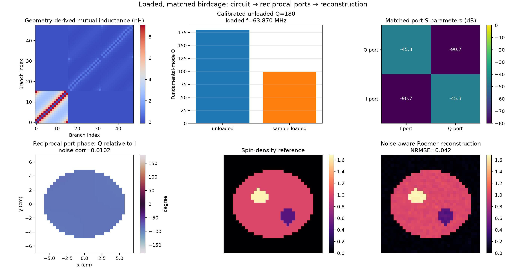

# Birdcage Coils: Quadrature, Circuits, and Loaded Reception

Phase 5 proceeds from a prescribed-current reference model to resonant ladder
circuits and a loaded/matched reciprocal multiport layer. The reference model
states the expected rung currents, completes the end-ring currents by
Kirchhoff's current law, and computes the resulting complex magnetic field.
This gives the circuit implementations an independent field and mode benchmark.

## Geometry and branch orientation

`BirdcageGeometry` creates:

- \(N\) straight rungs at
  \(\phi_n=2\pi n/N\), directed from the negative to the positive axial end;
- one positive and one negative end ring;
- \(N\) separately addressable arc sections on each end ring, directed toward
  increasing azimuth.

Each arc can be subdivided into several chords for Biot-Savart convergence.
The geometry supports cages along the Cartesian x, y, or z axis and uses a
right-handed transverse basis.

```python
from spin_dynamics.fields import BirdcageGeometry

cage = BirdcageGeometry(
    radius=0.15,
    length=0.30,
    n_rungs=16,
    axis="z",
    ring_segments_per_section=8,
)
```

## Current modes and end-ring KCL

For prescribed rung currents \(I_n\), the positive and negative end-ring
section currents \(J_n^+\) and \(J_n^-\) satisfy

\[
  J_n^+ - J_{n-1}^+ = I_n,\qquad
  J_n^- - J_{n-1}^- = -I_n.
\]

A closed cage requires \(\sum_n I_n=0\). `birdcage_current_mode` chooses the
minimum-norm end-ring solution by removing the otherwise arbitrary common
circulating current. The returned `BirdcageCurrentMode` exposes the complete
complex branch-current phasors and the node-by-node KCL residual.

The ideal sinusoidal modes are

\[
  I_n = I_0\cos(m\phi_n-\alpha).
\]

For the fundamental \(m=1\), \(\alpha=0\) and \(\alpha=\pi/2\) give the
degenerate cosine and sine modes. `birdcage_linear_mode` constructs either
orientation.

## Quadrature and circular components

`birdcage_quadrature_mode` combines the degenerate modes with a 90-degree
temporal phase:

\[
  I_n = I_0 \exp(-i h m\phi_n),\qquad h\in\{-1,+1\}.
\]

With the cage axis and \(B_0\) along +z, `handedness=+1` produces the package's
transmit convention

\[
  B_1^+ = \frac{B_x+iB_y}{2},
\]

while `handedness=-1` produces the opposite rotating component
\(B_1^-=(B_x-iB_y)/2\). The sign convention is explicit because changing the
phasor time convention or reversing \(B_0\) reverses the physical rotation
label.

```python
from spin_dynamics.fields import (
    birdcage_quadrature_mode,
    solve_birdcage_field,
)

mode = birdcage_quadrature_mode(cage, handedness=1)
solution = solve_birdcage_field(cage, mode, points_m)

b1_plus = solution.b1_plus_t
b1_minus = solution.b1_minus_t
```

The field solver sums the finite straight-segment Biot-Savart field of every
rung and end-ring branch, multiplied by its complex current phasor. It returns
the full complex Cartesian field as well as B1+ and B1-.

## Uniformity and circularity metrics

`birdcage_field_metrics` reports within a selected ROI:

- mean magnitude of the requested circular component;
- coefficient of variation;
- peak-to-peak nonuniformity divided by the mean;
- normalized circularity
  \((P_\mathrm{desired}-P_\mathrm{counter})/
  (P_\mathrm{desired}+P_\mathrm{counter})\);
- counter-rotating amplitude ratio and isolation in dB;
- fraction of total RMS field transverse to \(B_0\).

These metrics distinguish three effects that a center-field number alone
cannot:

1. spatial B1 magnitude variation;
2. ellipticity or counter-rotating contamination;
3. unwanted axial field.

Run the reference example with:

```powershell
python examples\plot_birdcage_quadrature.py --rungs 16 --radius-cm 15 --length-cm 30 --output results\birdcage_quadrature.png
```

The figure shows the explicit branches, the cosine/sine rung currents, their
center-field polarization, the midplane B1+ magnitude, percent nonuniformity,
and circular isolation.

## Validation and current boundary

The analytical and regression checks require:

- end-ring KCL to numerical precision;
- equal center-field magnitude for the fundamental cosine and sine modes;
- orthogonal center fields for those modes;
- selection of opposite circular components when quadrature handedness is
  reversed;
- sub-percent central-ROI coefficient of variation and high circular isolation
  for the reference 16-rung cage;
- convergence as each end-ring arc is segmented more finely.

## Resonant circuit layer

`BirdcageCircuit` adds series resistance, inductance, and optional capacitance
to every rung and end-ring section. Component arguments may be scalars for a
uniform cage or length-\(N\) arrays for tolerance and fault studies. End-ring
values describe one section and are applied to the matching section on both
rings.

The conventional architectures are represented directly:

- low-pass: capacitors in the rungs and continuous end rings;
- high-pass: capacitors in the end-ring sections and continuous rungs;
- band-pass: capacitors in both branch families.

For a closed cage, the rung-current vector has zero sum. If \(T\) completes
those currents into the positive end ring, the negative-ring currents are
\(-T I\). A branch quantity \(X\), such as resistance or inductance, therefore
reduces to

\[
  X_\mathrm{eff}
  = \operatorname{diag}(X_\mathrm{rung})
  + 2T^\mathsf{T}\operatorname{diag}(X_\mathrm{ring})T.
\]

The lossless modes follow from

\[
  C_\mathrm{eff}^{-1} I
  = \omega^2 L_\mathrm{eff} I,
\]

solved in an orthonormal zero-sum basis. This produces \(N-1\) rung-current
modes, including the two orientations of each degenerate azimuthal family.
The returned modes include complete KCL-consistent branch currents and the
series-loss estimate

\[
  Q = \omega
  \frac{I^\mathrm{H}L_\mathrm{eff}I}
       {I^\mathrm{H}R_\mathrm{eff}I}.
\]

The branch resistances are inputs, not predictions from the centerline
geometry: `BirdcageGeometry` does not specify conductor cross-section,
plating, joints, capacitors, or shield loss. Consequently an example Q must be
identified as assumed/measured or supplied by a separate conductor-loss model.
Both Phase 5 circuit examples default to an explicit unloaded Q of 180 via
`--unloaded-q`; they do not claim that value follows from the filament model.

For uniform branch values and \(s_m=\sin(\pi m/N)\), the implemented analytical
check is

\[
  \omega_m^2 =
  \frac{C_\mathrm{rung}^{-1}
       +(2s_m^2 C_\mathrm{ring})^{-1}}
       {L_\mathrm{rung}+L_\mathrm{ring}/(2s_m^2)},
\]

with absent capacitor terms set to zero. This is also used by the tuned
low-pass and high-pass factories.

```python
from spin_dynamics.fields import tuned_low_pass_birdcage

circuit = tuned_low_pass_birdcage(
    cage,
    63.87e6,
    rung_inductance_h=180e-9,
    end_ring_inductance_h=35e-9,
    rung_resistance_ohm=0.08,
    end_ring_resistance_ohm=0.015,
)
analysis = circuit.modal_analysis()
fundamental_pair = analysis.azimuthal_modes(1)
print(fundamental_pair[0].frequency_hz)
print(fundamental_pair[0].quality_factor)
```

### Tolerances, splitting, and driven quadrature

Nonuniform component arrays break rotational symmetry. The modal solver then
predicts the frequency splitting of the nominal cosine/sine pair:

```python
import numpy as np
from spin_dynamics.fields import BirdcageCircuit

capacitors = np.array(circuit.rung_capacitance_f)
capacitors[0] *= 1.03
perturbed = BirdcageCircuit(
    geometry=cage,
    rung_inductance_h=circuit.rung_inductance_h,
    end_ring_inductance_h=circuit.end_ring_inductance_h,
    rung_capacitance_f=capacitors,
    rung_resistance_ohm=circuit.rung_resistance_ohm,
    end_ring_resistance_ohm=circuit.end_ring_resistance_ohm,
)
print(perturbed.modal_analysis().splitting_hz(1))
```

`solve_drive` solves the complex finite-loss impedance matrix for series
voltage sources inserted into rung branches. The quadrature helper places two
equal sources one quarter-cage apart and drives them 90 degrees apart in RF
phase. Its returned `BirdcageCurrentMode` passes directly to
`solve_birdcage_field`, so capacitor imbalance can be followed all the way to
B1 nonuniformity and counter-rotating contamination.

Run the circuit example with:

```powershell
python examples\plot_birdcage_circuit.py --unloaded-q 180 --output results\birdcage_circuit.png
```

The figure compares low- and high-pass modal spectra, shows the split driven
response after one capacitor is shifted, and compares balanced and perturbed
B1 maps and circular isolation. Field panels show the central 70%-radius bore
so the ideal filament singularity near a rung does not set the color scale.
Each B1+ map is normalized to its own ROI mean to expose spatial structure,
while its title reports the ROI amplitude relative to the balanced cage.
Isolation limits use robust percentiles within the displayed bore; negative
values mean that B1- is stronger than the intended B1+ component.

## Loaded and matched multiport layer

`birdcage_multiport` completes the lumped Phase 5 path by retaining the same
KCL-constrained rung coordinates while adding branch mutual inductance,
conductive loading, physical ports, matching, reciprocity, and passive noise.
The branch order is all rungs, positive end-ring sections, then negative
end-ring sections. The transform

\[
  B = \begin{bmatrix}I & T & -T\end{bmatrix}^{\mathsf T}
\]

maps a closed-cage rung-current vector into those \(3N\) physical branches.
A full branch coupling or loss matrix therefore reduces as
\(B^\mathsf{T}X_\mathrm{branch}B\).

### Mutual inductance and conductive loading

`birdcage_branch_mutual_inductance_matrix` evaluates the exact filament mutual
partial inductance between every pair of explicit rung and end-ring paths. Its
diagonal is zero because the self inductances remain the values supplied to
`BirdcageCircuit`. `BirdcageBranchLoading` combines that symmetric coupling
matrix with an additive positive-semidefinite resistance matrix.

`birdcage_conductive_loading_resistance` evaluates the first-order magnetic
loss matrix

\[
  R_{ij}(\omega)=\omega^2\int_V\sigma(\mathbf r)
  \mathbf A_i(\mathbf r)\mathbin{\cdot}\mathbf A_j(\mathbf r)\,dV,
\]

where \(\mathbf A_i\) is the unit-current vector potential of branch \(i\).
This is the multi-branch form of reflected sample resistance. It produces
correlated physical loss and decreases loaded Q. It can also represent a
voxelized conductive shield, subject to the same approximation boundary.

`BirdcageLoadedCircuit` solves the resulting loaded modes and driven response.
`retune_loaded_birdcage` uniformly rescales the installed capacitors to restore
a selected loaded resonance. This scaling is exact for the frequency-independent
lumped inductance and resistance matrices used by this layer.
`calibrate_birdcage_conductor_quality_factor` scales only the explicit rung and
end-ring resistances to a selected modal Q while retaining mutual inductance and
fixed loading loss. This is the appropriate bridge to a measured or assumed
unloaded Q. The unloaded state must already include mutual coupling; sample
resistance is then added to the same model to obtain loaded Q.

### Physical ports, matching, and S parameters

`BirdcageMultiport` places series feeds in selected rung branches. If \(P\)
selects those branches and \(Q\) spans the zero-sum rung subspace, the physical
port admittance is

\[
  Y_\mathrm{port}=(Q^\mathsf{T}P)^\mathsf{T}
  (Q^\mathsf{T}ZQ)^{-1}(Q^\mathsf{T}P).
\]

The inverse gives the reciprocal port impedance matrix. Equal-reference
scattering parameters follow from

\[
  S=(Z-Z_0I)(Z+Z_0I)^{-1}.
\]

`design_independent_l_match` returns a lossless series-then-shunt L match for
each port diagonal. The full coupled matrix is retained when the matched input
impedance and S parameters are evaluated, so residual coupling remains visible
as S21 rather than being silently removed by an ideal decoupler. The helper
currently covers ports with \(0<\operatorname{Re}Z\le Z_0\), the normal
low-resistance birdcage-feed case.

### Receive reciprocity and passive noise

`solve_birdcage_receive_sensitivities` imposes one ampere at each unmatched or
matched input port, solves all physical branch currents, and returns the complex
B1- field per input ampere. Its result follows the same channel-leading
`normalized_complex` convention as the receiver-array imaging code.

For a passive network at temperature \(T\), the open-circuit voltage-noise
spectral density is

\[
  \Psi_v=4k_\mathrm{B}T\,\frac{Z_\mathrm{in}+Z_\mathrm{in}^{\mathrm H}}{2}.
\]

The result exposes both this absolute covariance and its dimensionless
correlation matrix for covariance-aware Roemer or SENSE reconstruction.

```python
from spin_dynamics.fields import (
    BirdcageBranchLoading,
    BirdcageMultiport,
    birdcage_branch_mutual_inductance_matrix,
    calibrate_birdcage_conductor_quality_factor,
    design_independent_l_match,
    retune_loaded_birdcage,
    solve_birdcage_receive_sensitivities,
)

mutual = birdcage_branch_mutual_inductance_matrix(cage)
mutual_only = BirdcageBranchLoading(
    3 * cage.n_rungs,
    inductance_coupling_h=mutual,
)
unloaded = calibrate_birdcage_conductor_quality_factor(
    retune_loaded_birdcage(circuit, mutual_only, 63.87e6),
    180.0,
)
loading = BirdcageBranchLoading(
    3 * cage.n_rungs,
    inductance_coupling_h=mutual,
    resistance_ohm=sample_loss_matrix,
)
loaded = retune_loaded_birdcage(unloaded.circuit, loading, 63.87e6)
ports = BirdcageMultiport(loaded, (0, cage.n_rungs // 4))
match = design_independent_l_match(
    ports.impedance_matrix_ohm(63.87e6),
    63.87e6,
)
receive = solve_birdcage_receive_sensitivities(
    ports,
    63.87e6,
    points_m,
    matching=match,
    normalization_weights=rho,
)
```

Run the complete loaded receive example with:

```powershell
python examples\plot_birdcage_loaded_receive.py --unloaded-q 180 --output results\birdcage_loaded_receive.png
```



It shows the branch mutual-inductance matrix, calibrated unloaded and
sample-loaded Q, matched S parameters, reciprocal I/Q-port phase, the
spin-density reference, and a
covariance-aware Roemer reconstruction.

### Phase 5 completion boundary

Phase 5 now covers the planned lumped, quasistatic birdcage workflow from
explicit geometry through loaded/matched transmit and receive ports. The
remaining higher-fidelity extensions are not prerequisites for this phase:
frequency-dependent PEEC branch resistance, charge-corrected sample currents,
finite-thickness shield currents, matching-component loss and tolerances,
transmit-amplifier/hybrid models, SAR, and full-wave propagation. Those should
be treated as later RF-engineering or full-wave layers rather than folded into
the validated lumped reference model.

## References

- C. E. Hayes, W. A. Edelstein, J. F. Schenck, O. M. Mueller, and M. Eash,
  “An efficient, highly homogeneous radiofrequency coil for whole-body NMR
  imaging at 1.5 T,” *Journal of Magnetic Resonance* **63** (1985), 622–628,
  <https://doi.org/10.1016/0022-2364(85)90257-4>.
- J.-M. Jin, *Electromagnetic Analysis and Design in Magnetic Resonance
  Imaging*, CRC Press, 1999,
  <https://www.routledge.com/Electromagnetic-Analysis-and-Design-in-MagneticResonance-Imaging/Jin/p/book/9780849396939>.
- C.-L. Chin, C. M. Collins, S. Li, B. J. Dardzinski, and M. B. Smith,
  “BirdcageBuilder: Design of specified-geometry birdcage coils with desired
  current pattern and resonant frequency,” *Concepts in Magnetic Resonance*
  **15** (2002), 156–163, <https://doi.org/10.1002/cmr.10030>.
- S. F. Ahmad et al., “Recent progress in birdcage RF coil technology for MRI
  systems,” *Diagnostics* **10** (2020), 1017,
  <https://doi.org/10.3390/diagnostics10121017>.
