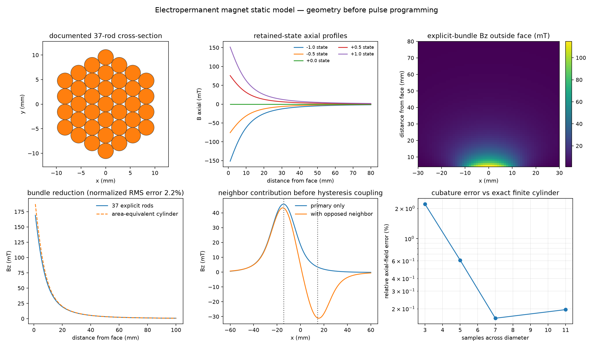
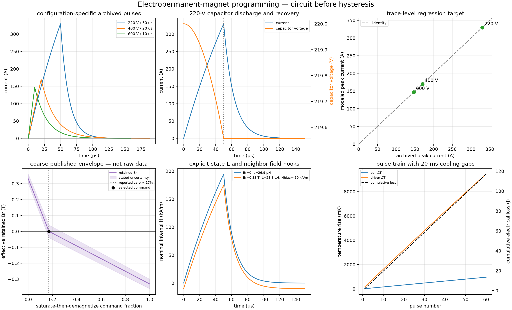
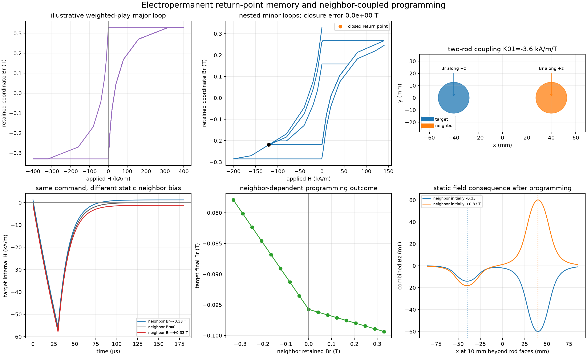

# Electropermanent AlNiCo magnets

PythonSpinDynamics models the static geometry, programming electronics, thermal
response, and protocol-calibrated retained state of electropermanent magnets
(EPMs). The current implementation targets AlNiCo rods and close-packed rod
bundles used as reconfigurable `B0` sources.

## Why retained state is separate from material data

The nominal remanence of AlNiCo-5 is not automatically the operating remanence
of a finite EPM rod. Aspect ratio, self-demagnetizing field, partial
programming, neighboring magnets, temperature, and pulse history can all move
the retained state away from nominal material `Br`.

The API therefore separates:

- `AlNiCoMaterial`: nominal `Br`, coercivity, recoil permeability,
  conductivity, density, and optional tabulated field-solver B-H data;
- `RemanenceState`: signed retained axial remanence, reversal-point metadata,
  temperature, calibration identifier, uncertainty, and evidence;
- `ElectropermanentRod`: finite cylindrical geometry and orientation;
- `ElectropermanentBundle`: explicit rods plus bundle-level programming-coil
  metadata; and
- `EvidenceRecord`: measured, simulated, specified, or inferred provenance.

This distinction is important for AlNiCo. For example, the
`variable_field_nmr_rod()` preset has nominal material `Br = 1.27 T`, but its
default effective retained remanence is `0.33 T`, inferred from the published
field of approximately 150 mT at 1 mm from the rod face.

## Documented presets

| Preset | Geometry and evidence |
|---|---|
| `variable_field_nmr_rod()` | One 25.4 mm diameter, 152.4 mm long AlNiCo-5 rod; 50 turns of 14 AWG wire; nominal 25 uH. Geometry is specified by Ropp et al. (2019); effective retained remanence is explicitly inferred. |
| `weinberg_37_rod_bundle()` | 37 close-packed AlNiCo-5 rods, each 3.175 mm diameter and 101.6 mm long; approximately 60 turns of 16 AWG wire and 50 uH. Geometry comes from the 2020 Weinberg project records. The preset defaults to zero retained remanence because no single calibrated retained state applies to all archived tests. |
| `ALNICO5_AC500` | Nominal AC500 values from the archived magnet-coil calculator. |
| `ALNICO5_FEMM_2019` | AlNiCo-5 material record and 26-point B-H table recovered from the solved FEMM project. The table is static field-solver input, not a hysteresis loop. |

## Static field calculation

`electropermanent_field()` represents each finite rod by a volume cubature of
point dipoles. Rod axes may have any 3-D orientation, and fields from rods or
bundles superpose. Increase `n_cross` and `n_length` near magnet faces and check
convergence. The approximation is intended for points outside the magnetic
material.

For an axially magnetized cylinder, `finite_cylinder_on_axis_field()` provides
the exact uniform-magnetization axial result. It is useful for fast profiles
and numerical convergence tests.

```python
import numpy as np

from spin_dynamics.fields import (
    RemanenceState,
    finite_cylinder_on_axis_field,
    weinberg_37_rod_bundle,
)

state = RemanenceState(
    0.42,
    branch="partial",
    calibration_id="my-calibration-v1",
)
bundle = weinberg_37_rod_bundle(state=state)

points = np.array([
    [0.0, 0.0, 0.060],
    [0.010, 0.0, 0.060],
])
b_vector = bundle.field_vectors(points, n_cross=5, n_length=21)

equivalent = bundle.equivalent_cylinder()
b_axis = finite_cylinder_on_axis_field(0.060, equivalent)
```

The area-equivalent cylinder preserves total AlNiCo volume and magnetic dipole
moment. It is a useful far-field and optimization approximation, but it does
not preserve detailed near-field structure at the bundle face.

## Programming-pulse circuit

`PulsePowerDriver` integrates a capacitor bank, H-bridge, winding resistance
and inductance, passive recovery path, current and voltage limits, and lumped
coil/driver temperatures. During the command interval,

```text
C dVc/dt = -p I
L dI/dt = p (Vc - Vbridge) - I (Rcoil(T) + Rseries),
```

where `p` is the bridge polarity. After turn-off, the capacitor is disconnected
and current decays through `Rcoil + Rrecovery`. The NumPy RK4 integrator splits
steps exactly at the switching boundary. `PulseWaveform` reports realized
current, capacitor and bridge voltages, nominal internal `H`, electrical losses,
temperatures, field impulse, and an electrical energy-balance residual.

```python
import numpy as np

from spin_dynamics.fields import archived_igbt_pulse_cases

case = archived_igbt_pulse_cases()[0]  # 220 V / 50 us
times = np.linspace(0, 160e-6, 1001)
waveform = case.driver.simulate(times, case.pulse)

print(waveform.peak_current_a)
print(waveform.peak_internal_h_a_per_m)
print(waveform.coil_energy_j, waveform.driver_energy_j)
thermal_state = waveform.final_thermal_state
```

The archived 220 V/50 us, 400 V/20 us, and 600 V/10 us examples are separate
`PulseValidationCase` objects. Only voltage, gate duration, and peak current are
tagged as measured. Their effective inductances and common capacitance/resistance
assumptions are tagged as inferred because the archive does not establish that
all three traces used identical coils and wiring.

`state_inductance_fraction_at_saturation` provides a documented fixed-state
inductance hook for one pulse. `bias_field_a_per_m` adds a static neighbor or
demagnetizing contribution to the reported internal field. These hooks can be
used directly, or assembled into the self-consistent iteration described below.

## Empirical retained-state transitions

`EmpiricalProgrammingCalibration` maps a realized pulse metric to retained
remanence. Supported metrics are command duty fraction, peak internal `H`,
absolute `H` impulse, and signed `H` impulse. Every calibration declares its
valid initial branch, pulse polarity, command range, extrapolation behavior,
uncertainty, and evidence.

```python
from spin_dynamics.fields import (
    ProgrammingPulse,
    RemanenceState,
    published_demagnetization_calibration,
)

pulse = ProgrammingPulse(
    220.0,
    50e-6,
    polarity=-1,
    command_fraction=0.17,
)
waveform = case.driver.simulate(times, pulse)
initial = RemanenceState(0.33, branch="positive_saturation")
result = published_demagnetization_calibration().apply(initial, waveform)
```

The published preset is deliberately conservative. The cropped figure supports
positive and negative endpoints and a zero crossing near 17 percent duty, so
the preset uses only those three anchors with graphical-extraction uncertainty.
It is an inferred envelope, not a digitized raw dataset or a general minor-loop
hysteresis model. Applying it with the wrong initial branch or polarity raises
an error.

## Return-point memory and neighbor coupling

`PlayHysteresisModel` represents rate-independent return-point memory with a
weighted collection of scalar play operators. For threshold `r_i`, each hidden
coordinate is advanced by

```text
y_i <- max(H - r_i, min(H + r_i, y_i_previous)),
Br  = Br_sat(T) sum_i w_i clip(y_i / r_i, -1, 1).
```

This construction closes nested reversal loops exactly and wipes an inner loop
when the field exceeds its enclosing reversal. `ReturnPointState` keeps the
hidden coordinates and reversal stack separate from the public
`RemanenceState`; `ReturnPointTrace` returns both retained remanence and applied
field histories. `illustrative_alnico_return_point_model()` is a numerically
useful preset, but its thresholds and weights are inferred and are **not** a
fit to measured AlNiCo minor loops.

`neighbor_coupling_matrix()` derives the axial field at every source from a
unit retained remanence in every other finite EPM. Off-diagonal entries have
units `(A/m)/T`. An optional demagnetizing-factor vector adds diagonal
`-N / mu0` terms. `CoupledEPMProgrammer` then iterates the retained states,
state-dependent winding inductance, pulse waveform, and static internal bias to
a declared remanence tolerance.

```python
from spin_dynamics.fields import (
    CoupledEPMProgrammer,
    illustrative_alnico_return_point_model,
    neighbor_coupling_matrix,
)

sources = (target_rod, neighbor_rod)
coupling = neighbor_coupling_matrix(sources, demagnetizing_factors=(0.02, 0.02))
programmer = CoupledEPMProgrammer(
    sources,
    (driver, driver),
    (illustrative_alnico_return_point_model(),) * 2,
    coupling,
)
result = programmer.program(
    0, times, target_pulse, states=initial_return_point_states
)
updated_sources = result.final_sources
```

The present coupling is quasistatic during each fixed-point iteration: the
neighbor contributes its retained field, while the target experiences its
realized programming waveform. It does not yet solve transient programming-coil
cross-talk or pulse-driven changes in a neighbor's hidden hysteresis state.

## Imaging and motion compatibility

`sample_electropermanent_field()` samples one or more sources on a 1-D, 2-D,
or 3-D Cartesian grid. Its result contains vector `B0`, projected `B0`, field
magnitude, magnitude-gradient, and proton Larmor-frequency maps.

```python
from spin_dynamics.fields import sample_electropermanent_field

maps = sample_electropermanent_field(
    (x_axis, z_axis),
    (bundle,),
    field_direction=(0, 0, 1),
)

motion_maps = maps.to_motion_field_maps()
imaging_maps = maps.to_spatial_field_maps(
    rho=phantom,
    t1_map=t1,
    t2_map=t2,
)
```

Both adapters convert tesla to angular-frequency off-resonance using the same
convention as existing workflows. By default, the projected field at the grid
sample nearest the origin is removed. Pass `reference_field_t=0` to retain
absolute angular frequency.

## Plotting examples

The magnet-only example compares explicit rods with the equivalent cylinder,
shows partial-remanence states and neighbor contributions, and verifies
cubature against the exact finite-cylinder expression:

```powershell
python examples\plot_electropermanent_magnet.py \
  --remanence-t 0.42 \
  --output results\electropermanent_magnet.png
```

It prints the provenance class, retained fraction of nominal `Br`, bundle
dimensions and magnetic moment, inferred published surface-field benchmark,
equivalent-cylinder error, and the field contribution of an opposed neighbor.



The programming example plots all three archived current responses, capacitor
droop and recovery, modeled-versus-archived peak current, the coarse retained
state envelope, state-dependent inductance and neighbor-field hooks, and a
thermal pulse train:

```powershell
python examples\plot_electropermanent_programming.py \
  --command-fraction 0.17 \
  --pulse-count 60 \
  --output results\electropermanent_programming.png
```



The return-point example exercises nested loops and programs one of two
side-by-side rods while sweeping the retained state of its neighbor:

```powershell
python examples\plot_electropermanent_return_point.py \
  --separation-mm 80 \
  --output results\electropermanent_return_point.png
```

The six panels show the illustrative major loop, exact minor-loop closure,
geometry-derived interaction matrix, neighbor-biased pulse responses, the
programmed state versus neighbor remanence, and the resulting static field.



## Current limitations and next phase

The current phase still has important limits:

- the three-anchor demagnetization envelope is protocol-specific and cannot
  predict arbitrary minor loops or repeated reversals;
- the weighted-play preset demonstrates return-point behavior, but raw
  AlNiCo minor-loop data are still needed to calibrate its thresholds, weights,
  temperature dependence, and uncertainty;
- neighbor and self-demagnetizing fields participate in a converged quasistatic
  programming iteration, but transient coil cross-talk and pulse-driven changes
  of neighboring hidden states are not represented;
- discrete switching loss is included in cumulative driver energy but not
  deposited as a time-resolved temperature impulse; and
- conductive shielding is not yet connected to transient eddy-current loss.

The next phase is measured minor-loop calibration and transient two-element
interaction, followed by hybrid/array programming. Raw minor-loop,
repeated-pulse, and cross-talk measurements are needed before those models can
be quantitative defaults.
