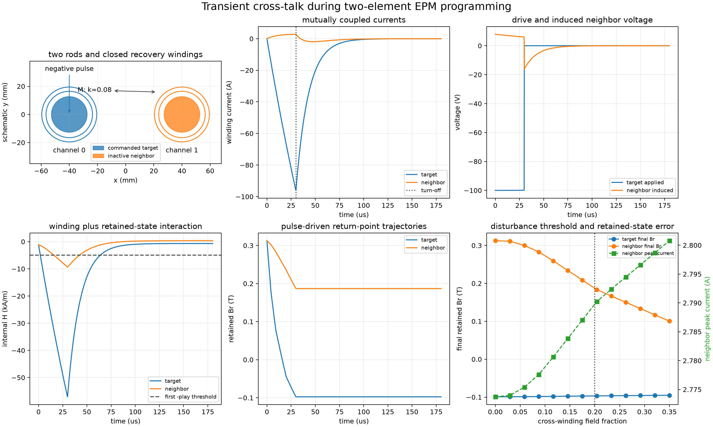
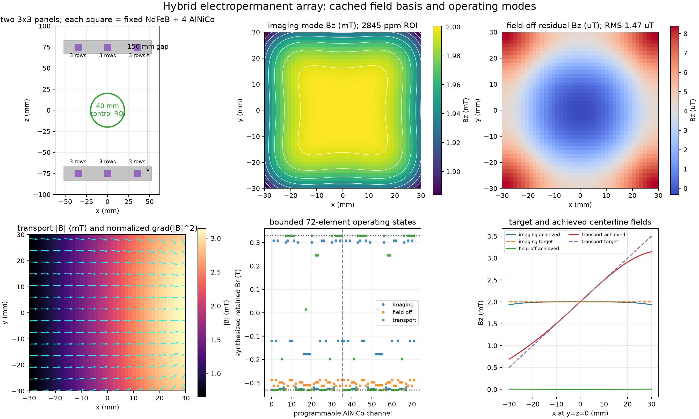
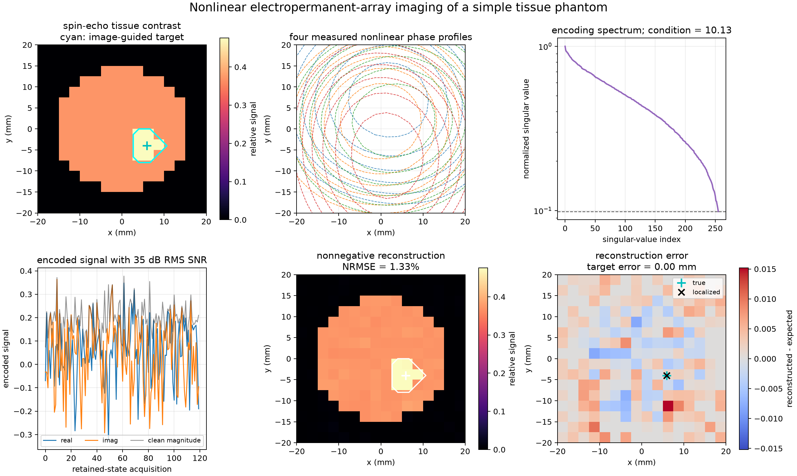
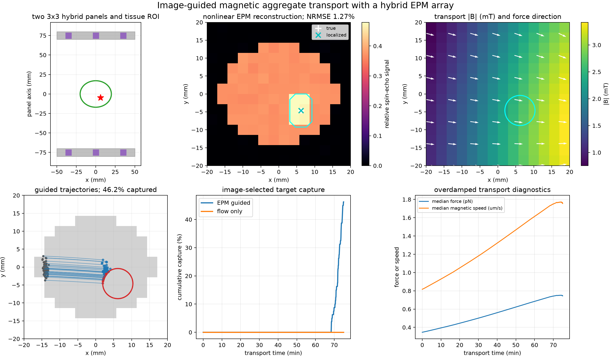
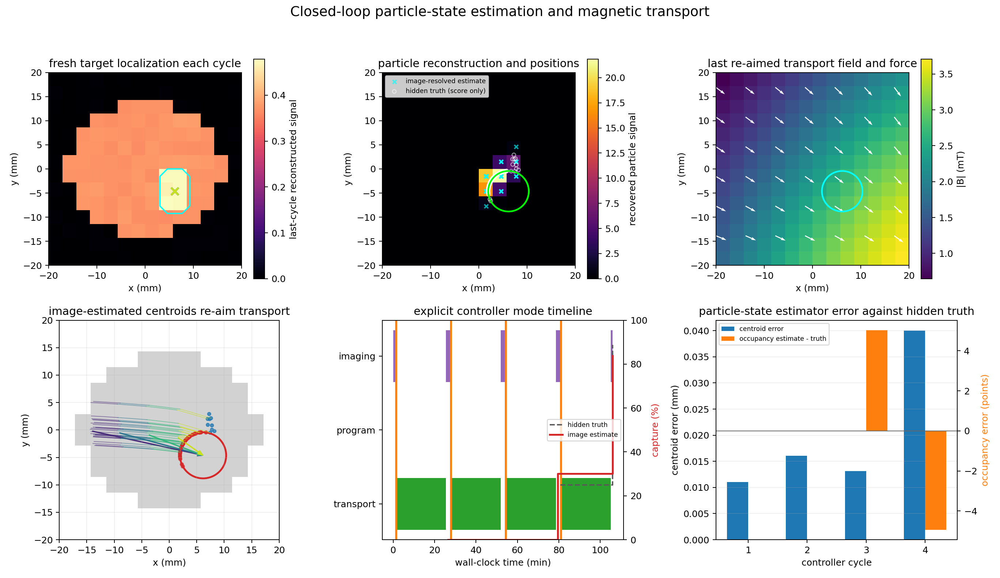
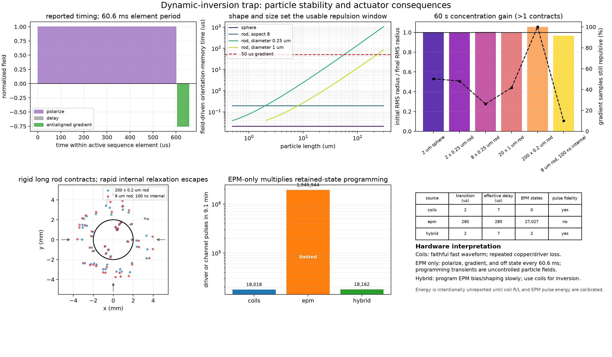

# Electropermanent Magnets: Hardware and Field Models

PythonSpinDynamics models the static geometry, programming electronics, thermal
response, and protocol-calibrated retained state of electropermanent magnets
(EPMs). The current implementation targets AlNiCo rods and close-packed rod
bundles used as reconfigurable `B0` sources.

This page is the hardware and actuator reference. For nonlinear particle
imaging, closed-loop delivery, and dynamic-inversion stability, use the
[Image-Guided Magnetic Therapy guide](image_guided_magnetic_therapy.md).

## Why retained state is separate from material data

The nominal remanence of AlNiCo-5 is not automatically the operating remanence
of a finite EPM rod. Aspect ratio, self-demagnetizing field, partial
programming, neighboring magnets, temperature, and pulse history can all move
the retained state away from nominal material `Br`.

The API therefore separates:

- `AlNiCoMaterial`: nominal `Br`, coercivity, recoil permeability,
  conductivity, density, and optional tabulated field-solver B-H data;
- `RemanenceState`: signed retained axial remanence, reversal-point metadata,
  temperature, calibration identifier, uncertainty, and evidence;
- `ElectropermanentRod`: finite cylindrical geometry and orientation;
- `ElectropermanentBundle`: explicit rods plus bundle-level programming-coil
  metadata; and
- `EvidenceRecord`: measured, simulated, specified, or inferred provenance.

This distinction is important for AlNiCo. For example, the
`variable_field_nmr_rod()` preset has nominal material `Br = 1.27 T`, but its
default effective retained remanence is `0.33 T`, inferred from the published
field of approximately 150 mT at 1 mm from the rod face.

## Documented presets

| Preset | Geometry and evidence |
|---|---|
| `variable_field_nmr_rod()` | One 25.4 mm diameter, 152.4 mm long AlNiCo-5 rod; 50 turns of 14 AWG wire; nominal 25 uH. Geometry is specified by Ropp et al. (2019); effective retained remanence is explicitly inferred. |
| `weinberg_37_rod_bundle()` | 37 close-packed AlNiCo-5 rods, each 3.175 mm diameter and 101.6 mm long; approximately 60 turns of 16 AWG wire and 50 uH. Geometry comes from the 2020 Weinberg project records. The preset defaults to zero retained remanence because no single calibrated retained state applies to all archived tests. |
| `ALNICO5_AC500` | Nominal AC500 values from the archived magnet-coil calculator. |
| `ALNICO5_FEMM_2019` | AlNiCo-5 material record and 26-point B-H table recovered from the solved FEMM project. The table is static field-solver input, not a hysteresis loop. |

## Static field calculation

`electropermanent_field()` represents each finite rod by a volume cubature of
point dipoles. Rod axes may have any 3-D orientation, and fields from rods or
bundles superpose. Increase `n_cross` and `n_length` near magnet faces and check
convergence. The approximation is intended for points outside the magnetic
material.

For an axially magnetized cylinder, `finite_cylinder_on_axis_field()` provides
the exact uniform-magnetization axial result. It is useful for fast profiles
and numerical convergence tests.

```python
import numpy as np

from spin_dynamics.fields import (
    RemanenceState,
    finite_cylinder_on_axis_field,
    weinberg_37_rod_bundle,
)

state = RemanenceState(
    0.42,
    branch="partial",
    calibration_id="my-calibration-v1",
)
bundle = weinberg_37_rod_bundle(state=state)

points = np.array([
    [0.0, 0.0, 0.060],
    [0.010, 0.0, 0.060],
])
b_vector = bundle.field_vectors(points, n_cross=5, n_length=21)

equivalent = bundle.equivalent_cylinder()
b_axis = finite_cylinder_on_axis_field(0.060, equivalent)
```

The area-equivalent cylinder preserves total AlNiCo volume and magnetic dipole
moment. It is a useful far-field and optimization approximation, but it does
not preserve detailed near-field structure at the bundle face.

## Programming-pulse circuit

`PulsePowerDriver` integrates a capacitor bank, H-bridge, winding resistance
and inductance, passive recovery path, current and voltage limits, and lumped
coil/driver temperatures. During the command interval,

```text
C dVc/dt = -p I
L dI/dt = p (Vc - Vbridge) - I (Rcoil(T) + Rseries),
```

where `p` is the bridge polarity. After turn-off, the capacitor is disconnected
and current decays through `Rcoil + Rrecovery`. The NumPy RK4 integrator splits
steps exactly at the switching boundary. `PulseWaveform` reports realized
current, capacitor and bridge voltages, nominal internal `H`, electrical losses,
temperatures, field impulse, and an electrical energy-balance residual.

```python
import numpy as np

from spin_dynamics.fields import archived_igbt_pulse_cases

case = archived_igbt_pulse_cases()[0]  # 220 V / 50 us
times = np.linspace(0, 160e-6, 1001)
waveform = case.driver.simulate(times, case.pulse)

print(waveform.peak_current_a)
print(waveform.peak_internal_h_a_per_m)
print(waveform.coil_energy_j, waveform.driver_energy_j)
thermal_state = waveform.final_thermal_state
```

The archived 220 V/50 us, 400 V/20 us, and 600 V/10 us examples are separate
`PulseValidationCase` objects. Only voltage, gate duration, and peak current are
tagged as measured. Their effective inductances and common capacitance/resistance
assumptions are tagged as inferred because the archive does not establish that
all three traces used identical coils and wiring.

`state_inductance_fraction_at_saturation` provides a documented fixed-state
inductance hook for one pulse. `bias_field_a_per_m` adds a static neighbor or
demagnetizing contribution to the reported internal field. These hooks can be
used directly, or assembled into the self-consistent iteration described below.

## Empirical retained-state transitions

`EmpiricalProgrammingCalibration` maps a realized pulse metric to retained
remanence. Supported metrics are command duty fraction, peak internal `H`,
absolute `H` impulse, and signed `H` impulse. Every calibration declares its
valid initial branch, pulse polarity, command range, extrapolation behavior,
uncertainty, and evidence.

```python
from spin_dynamics.fields import (
    ProgrammingPulse,
    RemanenceState,
    published_demagnetization_calibration,
)

pulse = ProgrammingPulse(
    220.0,
    50e-6,
    polarity=-1,
    command_fraction=0.17,
)
waveform = case.driver.simulate(times, pulse)
initial = RemanenceState(0.33, branch="positive_saturation")
result = published_demagnetization_calibration().apply(initial, waveform)
```

The published preset is deliberately conservative. The cropped figure supports
positive and negative endpoints and a zero crossing near 17 percent duty, so
the preset uses only those three anchors with graphical-extraction uncertainty.
It is an inferred envelope, not a digitized raw dataset or a general minor-loop
hysteresis model. Applying it with the wrong initial branch or polarity raises
an error.

## Return-point memory and neighbor coupling

`PlayHysteresisModel` represents rate-independent return-point memory with a
weighted collection of scalar play operators. For threshold `r_i`, each hidden
coordinate is advanced by

```text
y_i <- max(H - r_i, min(H + r_i, y_i_previous)),
Br  = Br_sat(T) sum_i w_i clip(y_i / r_i, -1, 1).
```

This construction closes nested reversal loops exactly and wipes an inner loop
when the field exceeds its enclosing reversal. `ReturnPointState` keeps the
hidden coordinates and reversal stack separate from the public
`RemanenceState`; `ReturnPointTrace` returns both retained remanence and applied
field histories. `illustrative_alnico_return_point_model()` is a numerically
useful preset, but its thresholds and weights are inferred and are **not** a
fit to measured AlNiCo minor loops.

`neighbor_coupling_matrix()` derives the axial field at every source from a
unit retained remanence in every other finite EPM. Off-diagonal entries have
units `(A/m)/T`. An optional demagnetizing-factor vector adds diagonal
`-N / mu0` terms. `CoupledEPMProgrammer` then iterates the retained states,
state-dependent winding inductance, pulse waveform, and static internal bias to
a declared remanence tolerance.

```python
from spin_dynamics.fields import (
    CoupledEPMProgrammer,
    illustrative_alnico_return_point_model,
    neighbor_coupling_matrix,
)

sources = (target_rod, neighbor_rod)
coupling = neighbor_coupling_matrix(
    sources, self_demagnetizing_factors=(0.02, 0.02)
)
programmer = CoupledEPMProgrammer(
    sources,
    (driver, driver),
    (illustrative_alnico_return_point_model(),) * 2,
    coupling,
)
result = programmer.program(
    0, times, target_pulse, states=initial_return_point_states
)
updated_sources = result.final_sources
```

This first coupled programmer is useful when neighboring windings can be
ignored. The transient array model below includes their electrical and magnetic
response.

## Transient winding cross-talk

`MutualProgrammingCircuit` integrates all winding currents while one H-bridge
is commanded. Inactive channels are closed through their recovery resistors,
so positive mutual inductance produces the expected opposing induced current.
For inductance matrix `L`, channel resistance vector `R`, and commanded channel
`q`, the electrical model is

```text
L(Br) dI/dt = Vbridge - R(T, switch_state) I,
Cq dVc/dt = -polarity Iq.
```

`field_coupling_a_per_m_per_a[i, j]` maps winding `j` current to the
programming field at magnet `i`. `TransientCoupledEPMProgrammer` combines that
field with the retained-state interaction matrix at every sample,

```text
Hi(t) = sum_j Gij Ij(t) + sum_j Kij Brj(t),
```

advances every return-point state, and closes state-dependent self inductance
with an outer fixed-point iteration. `ArrayPulseWaveform` reports the full
current, applied/induced voltage, internal-field, loss, temperature, and energy
histories; `TransientProgrammingResult` adds every remanence trajectory and the
indices of disturbed non-target elements.

```python
from spin_dynamics.fields import (
    MutualProgrammingCircuit,
    TransientCoupledEPMProgrammer,
)

circuit = MutualProgrammingCircuit.from_coupling_coefficients(
    (driver_0, driver_1),
    [[0.0, 0.08], [0.08, 0.0]],
    field_coupling_fractions=[[1.0, 0.20], [0.20, 1.0]],
)
programmer = TransientCoupledEPMProgrammer(
    sources,
    (model_0, model_1),
    retained_field_coupling,
    circuit,
)
result = programmer.program(0, times, negative_pulse)
print(result.disturbed_indices)
```

The inactive-channel topology is deliberately explicit: this implementation
models a closed recovery path, not an open winding. Mutual-inductance and
winding-field matrices must be measured or independently solved for a
quantitative array prediction.

## Hybrid array and operating-state synthesis

`HybridEPMSubunit` groups fixed NdFeB sources with independently programmable
AlNiCo rods. `ElectropermanentArray` flattens those controls while preserving
panel and sub-unit identity. The `illustrative_hybrid_epm_array()` preset follows
the locally documented hierarchy: two opposing 3 by 3 panels, 18 hybrid
sub-units, four AlNiCo controls per sub-unit, 72 controls total, a 150 mm panel
gap, and a 40 mm control ROI. Its exact pitch, radii, length, and intra-sub-unit
layout are explicitly inferred until complete CAD is recovered.

`build_field_basis()` performs magnetostatics once and returns an
`ElectropermanentArrayFieldBasis` containing

```text
B(r) = B_fixed_NdFeB(r) + sum_i Br_i K_i(r),
```

where every `K_i` is the vector field per tesla of retained AlNiCo remanence.
The same cached basis supports multiple bounded state-synthesis objectives:

- `synthesize_uniform_imaging_state()` targets uniform projected B0;
- `synthesize_field_off_state()` minimizes the residual projected field; and
- `synthesize_transport_state()` targets an affine bias-plus-gradient field.

The general `synthesize_epm_array_state()` solves a weighted, regularized
least-squares problem subject to each element's retained-remanence limits. It
uses SciPy bounded least squares when available and includes a pure-NumPy
projected accelerated-gradient backend.

```python
from spin_dynamics.fields import (
    illustrative_hybrid_epm_array,
    synthesize_field_off_state,
    synthesize_transport_state,
    synthesize_uniform_imaging_state,
)

array = illustrative_hybrid_epm_array(panel_gap_m=0.150)
basis = array.build_field_basis(roi_points)
imaging = synthesize_uniform_imaging_state(basis, 2e-3)
field_off = synthesize_field_off_state(basis)
transport = synthesize_transport_state(
    basis,
    bias_field_t=2e-3,
    gradient_t_per_m=(0.050, 0.0, 0.0),
)
programmed_array = transport.applied_array()
```

The affine transport target is the linear field-design precursor to
magnetophoretic force synthesis.

## Nonlinear EPM imaging

`NonlinearEPMEncoding` converts multiple retained-remanence states into a dense
non-Fourier encoding matrix. For state `k` and voxel `j`, the model is

```text
s_k = sum_j rho_j exp(-i gamma tau [B_k(r_j) - B_k(r_ref)]).
```

Subtracting the field at `r_ref` represents receiver demodulation of the global
state frequency; it does not remove the spatially varying phase. Because the
EPM profiles are deliberately nonlinear, `reconstruct_epm_nonlinear_image()`
solves the measured matrix directly with dimensionless Tikhonov regularization
and optional nonnegativity rather than applying an FFT.

```python
from spin_dynamics.fields import illustrative_hybrid_epm_array
from spin_dynamics.workflows import (
    build_epm_nonlinear_encoding,
    random_epm_encoding_states,
    run_epm_nonlinear_imaging,
    simple_tissue_phantom,
)

phantom = simple_tissue_phantom(16, field_of_view_m=0.040)
array = illustrative_hybrid_epm_array()
basis = array.build_field_basis(phantom.points_m)
states = random_epm_encoding_states(basis, 384, seed=4)
encoding = build_epm_nonlinear_encoding(
    basis, states, image_shape=phantom.shape, phase_encoding_s=300e-6,
)
contrast = phantom.spin_echo_image(repetition_time_s=1.2, echo_time_s=0.040)
image = run_epm_nonlinear_imaging(encoding, contrast, snr_db=35.0, seed=5)
print(image.nrmse, encoding.condition_number)
```

The bundled `TissuePhantom2D` is intentionally simple: an elliptical soft-
tissue region and one off-center target carry illustrative proton density, T1,
and T2 values. It exercises contrast, nonlinear encoding, noise, reconstruction,
and localization without claiming clinical tissue constants.

## Image-guided superparamagnetic transport

`SuperparamagneticParticle` stores the magnetic material volume, low-field SI
susceptibility, saturation magnetization, hydrodynamic radius, viscosity, and
temperature. The linear force law is

```text
F = V chi grad(|B|^2) / (2 mu0).
```

The default Langevin path uses `M = Ms L(3 chi |B|/(mu0 Ms))`; this recovers the
same linear limit and approaches `Ms` smoothly. `magnetic_force_map_2d()`
differentiates a sampled vector field, while
`simulate_magnetophoretic_transport()` combines the resulting force with
Stokes drift `F/(6 pi eta r_h)`, Stokes--Einstein diffusion, background flow,
existing rectangular boundary handling, and irreversible circular-target
capture.

```python
from spin_dynamics.workflows import (
    SuperparamagneticParticle,
    magnetic_force_map_2d,
    simulate_magnetophoretic_transport,
)

force_map = magnetic_force_map_2d(x_axis, y_axis, transport_field)
aggregate = SuperparamagneticParticle(
    magnetic_core_radius_m=12e-6,
    hydrodynamic_radius_m=15e-6,
    magnetic_volume_fraction=0.60,
    volume_susceptibility=1.4,
    saturation_magnetization_a_m=4.5e5,
    fluid_viscosity_pa_s=1.5e-3,
)
result = simulate_magnetophoretic_transport(
    force_map, aggregate, initial_positions,
    duration_s=75 * 60, time_step_s=5,
    target_center_m=localized_target,
    target_radius_m=4.2e-3,
    background_velocity_m_s=(2.5e-6, 0.0), seed=10,
)
print(result.capture_fraction, result.peak_force_n)
```

The transport solver accepts any sampled vector field, so it is compatible
with the EPM basis, other magnetostatic sources, and the same SI position and
boundary conventions used by moving-isochromat workflows. Captured particles
are immobilized in this first model; adhesion kinetics, concentration-dependent
interactions, vascular branching, tissue permeability, and particle feedback
on the field or flow are not yet included.

## Alternating image-guided controller

`run_epm_image_guided_controller()` closes the first system-level loop. Each
cycle performs a fresh noisy nonlinear reconstruction, localizes the target by
a peak-relative threshold and signal-weighted centroid, forms the centroid of
the uncaptured particle population, synthesizes an affine EPM field directed
between those centroids, observes a programming dwell, and integrates one
transport burst. The run stops at the configured capture goal or cycle limit.

```python
from spin_dynamics.workflows import (
    EPMTherapyControllerConfig,
    run_epm_image_guided_controller,
)

closed_loop = run_epm_image_guided_controller(
    encoding, contrast, phantom.x_m, phantom.y_m,
    aggregate, initial_positions,
    config=EPMTherapyControllerConfig(
        max_cycles=4,
        capture_goal=0.70,
        imaging_window_s=90,
        programming_window_s=0.25,
        transport_window_s=24*60,
        transport_gradient_t_m=0.150,
    ),
    background_velocity_m_s=(2.5e-6, 0.0),
)
print(closed_loop.stop_reason, closed_loop.capture_fraction_by_cycle)
```

`ControllerModeInterval` makes the imaging, programming, and transport timing
explicit. Every `EPMTherapyCycleResult` retains the reconstruction, localized
target, feedback direction, synthesized state, force map, particle history,
and capture increment. Imaging-state and transport-state total remanence
variation are reported as channel-summed programming-effort metrics. They are
not electrical energy; energy requires a calibrated sequence of 72-channel
programming pulses and a selected driver model.

## Dynamic-inversion central trap

`simulate_dynamic_inversion()` removes the controller's irreversible-capture
assumption and implements the mechanism reported by Nacev et al. (Nano Letters
15, 2015, 359--364). Each direction first applies a uniform polarizing field,
waits for the configured delay, and then applies a short oppositely directed
gradient. A rigid ferromagnetic moment is initially repelled; mechanical or
internal moment rotation eventually reverses the force, so the gradient must
end while the moment is still antialigned.

```python
from spin_dynamics.workflows import (
    FerromagneticParticle,
    nacev_2015_sequence,
    simulate_dynamic_inversion,
)

rod = FerromagneticParticle(
    shape="rod",
    length_m=200e-6,
    diameter_m=200e-9,
    volume_susceptibility=0.65,
    saturation_magnetization_a_m=1.4e6,
    remanent_magnetization_a_m=1.0e6,
    fluid_viscosity_pa_s=0.7e-3,
)
sequence = nacev_2015_sequence(
    polarizing_field_t=0.5,
    gradient_field_at_center_t=0.2,
    actuator_radius_m=8e-3,
)
trap = simulate_dynamic_inversion(
    sequence,
    rod,
    initial_positions,
    duration_s=60.0,
    target_radius_m=2e-3,
    seed=3,
)
print(trap.stability.concentration_gain)
```

Spheres recover Stokes translation and rotation. Rods use the
Tirado--Martinez--de la Torre finite-cylinder drag expressions, including
parallel/perpendicular translation and tumbling rotation. Body and magnetic-
moment angles are distinct: `internal_relaxation_time_s=None` locks the moment
to the body, while a finite phenomenological time demonstrates the loss of
repulsion when domains or a superparamagnetic-like moment follow the gradient
too quickly. No target entry is immobilized. `DynamicInversionStability`
reports RMS-radius concentration gain, target retention and escape, the
fraction of gradient samples that remain repulsive, and an early log-radius
contraction rate.

The preset preserves the published 600 us polarizing pulse, 5 us delay, 50 us
gradient pulse, and 60.6 ms sequence-element period. Its field magnitudes and
inverse-power source radius remain explicit inferred inputs: the paper does
not provide the measured maps needed to reproduce force or concentration rate.

`assess_dynamic_inversion_hardware()` applies the same timing to three
architectures:

- **Fast coils:** two field pulses per element reproduce the intended waveform,
  but copper loss and driver stress repeat for the entire trap duration.
- **EPM only:** at least polarize, gradient, and field-off retained states are
  required every element. A 9.1 minute run contains about 9,009 elements,
  27,027 array states, and nearly 1.95 million channel pulses when all 72
  channels change. Programming transients are not calibrated therapeutic
  fields, so waveform fidelity defaults to infeasible.
- **Hybrid EPM plus coils:** the EPM array supplies a slowly changed bias or
  shaping state while coils create the fast inversion waveform. This retains
  coil loss but reduces EPM cycling to setup and teardown. The current result
  is an architecture assessment; a specific 72-channel bias state and its
  static particle force have not yet been synthesized.

## Imaging and motion compatibility

`sample_electropermanent_field()` samples one or more sources on a 1-D, 2-D,
or 3-D Cartesian grid. Its result contains vector `B0`, projected `B0`, field
magnitude, magnitude-gradient, and proton Larmor-frequency maps.

```python
from spin_dynamics.fields import sample_electropermanent_field

maps = sample_electropermanent_field(
    (x_axis, z_axis),
    (bundle,),
    field_direction=(0, 0, 1),
)

motion_maps = maps.to_motion_field_maps()
imaging_maps = maps.to_spatial_field_maps(
    rho=phantom,
    t1_map=t1,
    t2_map=t2,
)
```

Both adapters convert tesla to angular-frequency off-resonance using the same
convention as existing workflows. By default, the projected field at the grid
sample nearest the origin is removed. Pass `reference_field_t=0` to retain
absolute angular frequency.

## Plotting examples

The magnet-only example compares explicit rods with the equivalent cylinder,
shows partial-remanence states and neighbor contributions, and verifies
cubature against the exact finite-cylinder expression:

```powershell
python examples\plot_electropermanent_magnet.py \
  --remanence-t 0.42 \
  --output results\electropermanent_magnet.png
```

It prints the provenance class, retained fraction of nominal `Br`, bundle
dimensions and magnetic moment, inferred published surface-field benchmark,
equivalent-cylinder error, and the field contribution of an opposed neighbor.


The programming example plots all three archived current responses, capacitor
droop and recovery, modeled-versus-archived peak current, the coarse retained
state envelope, state-dependent inductance and neighbor-field hooks, and a
thermal pulse train:

```powershell
python examples\plot_electropermanent_programming.py \
  --command-fraction 0.17 \
  --pulse-count 60 \
  --output results\electropermanent_programming.png
```


The return-point example exercises nested loops and programs one of two
side-by-side rods while sweeping the retained state of its neighbor:

```powershell
python examples\plot_electropermanent_return_point.py \
  --separation-mm 80 \
  --output results\electropermanent_return_point.png
```

The six panels show the illustrative major loop, exact minor-loop closure,
geometry-derived interaction matrix, neighbor-biased pulse responses, the
programmed state versus neighbor remanence, and the resulting static field.


The transient example shows why static neighbor bias alone is insufficient:

```powershell
python examples\plot_electropermanent_transient_crosstalk.py \
  --mutual-coefficient 0.08 \
  --leakage-fraction 0.20 \
  --output results\electropermanent_transient_crosstalk.png
```

It plots both winding currents, applied and induced voltages, internal fields,
time-resolved retained states, and a leakage sweep that locates the neighbor
disturbance threshold.



The hybrid-array example reuses one ROI basis to synthesize three operating
modes, then evaluates them on a denser mid-plane map:

```powershell
python examples\plot_epm_hybrid_array_synthesis.py \
  --imaging-field-mt 2 \
  --transport-gradient-mt-per-m 50 \
  --output results\epm_hybrid_array_synthesis.png
```



The nonlinear-imaging example uses 384 retained states to reconstruct a 16 by
16 spin-echo tissue phantom and reports both image error and target localization:

```powershell
python examples\plot_epm_nonlinear_tissue_imaging.py \
  --matrix-size 16 \
  --encodings 384 \
  --output results\epm_nonlinear_tissue_imaging.png
```



The image-guided transport example reconstructs the same tissue target, uses
its centroid to set the affine EPM transport direction, and compares magnetic
guidance with an otherwise matched nonmagnetic flow-only control:

```powershell
python examples\plot_epm_image_guided_transport.py \
  --transport-gradient-mt-per-m 150 \
  --duration-min 75 \
  --output results\epm_image_guided_transport.png
```



The closed-loop example repeats the entire decision sequence and exposes its
mode timeline and per-cycle outcome:

```powershell
python examples\plot_epm_closed_loop_controller.py \
  --cycles 4 --transport-min 24 --capture-goal 0.70 \
  --output results\epm_closed_loop_controller.png
```



The dynamic-inversion example sweeps sphere and rod dimensions, contrasts a
rigid ferromagnetic moment with a 100 ns internal-relaxation control, and counts
the switching burden for coil, EPM-only, and hybrid architectures:

```powershell
python examples\plot_epm_dynamic_inversion.py \
  --duration-s 60 \
  --output results\epm_dynamic_inversion.png
```



## Current limitations and next phase

The current phase still has important limits:

- the three-anchor demagnetization envelope is protocol-specific and cannot
  predict arbitrary minor loops or repeated reversals;
- the weighted-play preset demonstrates return-point behavior, but raw
  AlNiCo minor-loop data are still needed to calibrate its thresholds, weights,
  temperature dependence, and uncertainty;
- transient coil cross-talk and pulse-driven neighbor-state changes are now
  represented for a closed recovery path, but the bundled mutual-inductance and
  winding-leakage examples are inferred rather than measured array matrices;
- discrete switching loss is included in cumulative driver energy but not
  deposited as a time-resolved temperature impulse; and
- conductive shielding is not yet connected to transient eddy-current loss.
- the reference array hierarchy and gap are specified, but exact element
  dimensions and coupling matrices remain inferred; and
- nonlinear encoding, tissue-phantom reconstruction, Langevin-limited particle
  force, flow/diffusion trajectories, and target capture are implemented, while
  alternating image-guided control is implemented at the simulated-state tier.
- dynamic inversion includes particle orientation, finite-cylinder drag,
  moment relaxation, non-sticky stability metrics, and architecture counts,
  but its inverse-power sources are inferred rather than measured coil/EPM
  field maps; it remains 2-D, dilute, and outside vascular/tissue physics.

The next implementation phase estimates the particle distribution from
measurements rather than reading it directly from the simulator, and adds
vascular/tissue transport, adhesion, and delivery metrics. Measured minor
loops, repeated-pulse retention, exact CAD, and cross-talk matrices remain
necessary before the array can become a quantitative hardware digital twin.
