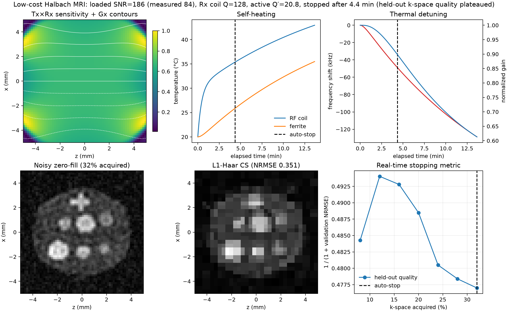
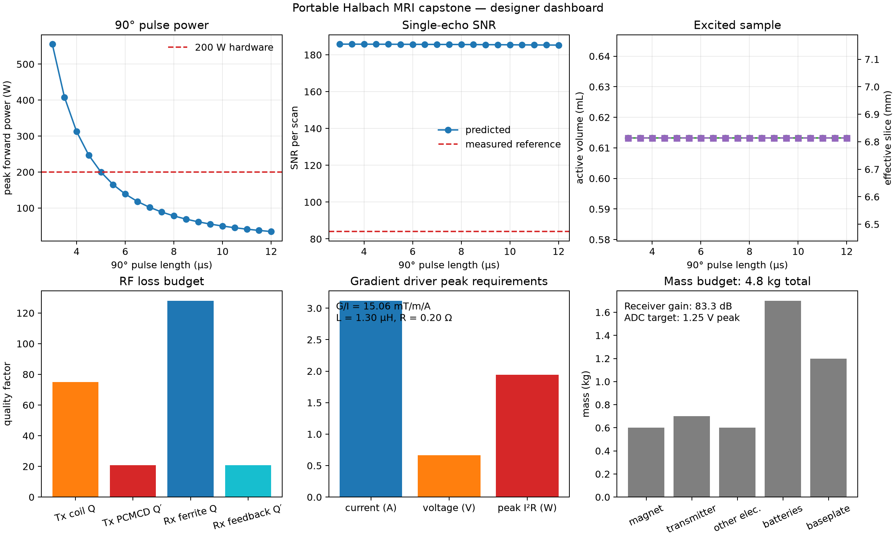

# Capstone: a complete portable MRI design study in a 15–20 minute run budget

Most documentation pages isolate one model. This capstone instead asks a system
question: if a compact Halbach magnet, RF coil, gradients, receiver, thermal
paths, and reconstruction algorithm are assembled into one scanner, which
component limits the image and how does a hardware change propagate through
the rest of the design?

Use this page after learning the individual imaging and hardware models. A
single run connects magnet and coil geometry, PEEC electrical properties,
ferrite RF loss, gradient-driver requirements, receiver gain, thermal drift,
noisy acquisition, compressed sensing, and automatic stopping. The low-cost C8
Halbach scanner from *Portable Low-Field MRI Scanners* supplies the reference
geometry and measured calibration inputs.

The workflow is deliberately compact enough for an interactive design loop;
the optimized 64×64 reference run completed in about 5.4 seconds on the
development workstation. That timing is illustrative rather than a guarantee
for every machine.

The important distinction throughout this chapter is:

- **predicted** values come from field, circuit, thermal, or reconstruction
  equations;
- **book-calibrated** values are measured component parameters used as inputs;
- **validation targets** are never used to generate simulated noise or images.

## Run the capstone

From the `PythonSpinDynamics` directory:

```powershell
python examples\plot_portable_halbach_adaptive_mri.py `
  --matrix-size 64 `
  --output results\portable_halbach_adaptive_mri.png `
  --design-output results\portable_halbach_design_dashboard.png `
  --data-output results\portable_halbach_capstone.npz
```

The command prints RF, gradient, receiver, and mass tables; writes both figures;
and saves the pulse-length sweep and reconstruction histories to the NPZ file.



*Figure 1. End-to-end system result. The noisy acquisition stops at 32% k-space
after held-out quality stops improving. The reference image is used only for the
reported NRMSE, never for the stopping decision.*



*Figure 2. Designer dashboard generated from the same run. The 5 µs point uses
the measured 200 W PCMCD operating point. The inset separates the receive-window
trade-off from the RF pulse-length sweep: integrated noise falls as the window
grows, but static-field dephasing eventually wins.*

## Model boundary and coordinates

The bore axis is `y`; the reconstructed plane is `x–z`. Gx and Gz are explicit
phase-encoding coils. There is no independently driven gradient along the bore
axis. The model therefore calls the thickness selected by the combination of
static-field inhomogeneity, RF bandwidth, and coil sensitivity the **effective
slice thickness**. This is not an ideal rectangular slice.

All B0, Tx B1, Rx B1, and gradient fields are evaluated over an `x–y–z` sample
volume. Excitation, receive sensitivity, probe response, and phase encoding are
applied voxel by voxel before the unencoded `y` direction is projected into the
image. The displayed 2-D field maps are projections of those volumes, not a
central-plane calculation.

The active-volume metric counts 3-D water voxels whose combined transmit and
off-resonance excitation is at least 50% of the on-resonance center value. The
effective thickness is active volume divided by the 9 mm sample diameter and
the modeled sample depth. Both definitions are configurable analysis
conventions rather than new hardware specifications.

## Hardware represented

| Subsystem | Model | Source |
|---|---|---|
| C8 Halbach | Eight finite 10×10×100 mm ferrite blocks, radius 21.7 mm, Br=385 mT, 2.5% RMS block mismatch | Book Table 3.2 plus stated construction tolerance |
| Receive chain | 30-turn AWG-24 parallel-tuned solenoid, high-Z differential JFET preamplifier, noiseless capacitive feedback damping | Book Table 4.4 and Fig. 6.1–6.3; PEEC plus probe response |
| Transmit chain | Inverse PCMCD current source, series-tuned four-turn 120° saddle pair, parallel resonant harmonic filter | Book Fig. 5.3 and Sect. 10.4; Biot–Savart plus measured envelope response |
| Gx/Gz coils | Two-turn four-wire saddles, radius 10.3 mm, length 83 mm | Book Table 4.4; Biot–Savart field |
| Receiver | Active Q reduction to Q′≈20.8 (200 kHz), 18 µs acquisition window, 1.5 dB representative noise figure with 0.4–3 dB measured bounds | Book operating point plus explicit interpolation |
| Thermal plant | RF coil, ferrite magnet, and ambient lumped nodes | System-level RC approximation |
| Reconstruction | Incoherent variable-density sampling; Haar checkpoints; final finite-difference TV-CS | Dependency-free package implementation |

The measured 0.88 T/m diffusion-weighting gradient magnitude is retained as a
sequence parameter but is not imposed as a signed linear ramp across the image.
Imaging offsets come from the full 3-D eight-block B0 solution itself. A fixed,
zero-mean 2.5% RMS remanence mismatch is applied block by block. It produces a
91.3 kHz peak-to-peak Larmor span across the modeled sample, within 9% of the
book's measured 100 kHz signal width, without rescaling the field distribution.
The mismatch seed and RMS level are explicit configuration values. This also
avoids confusing local static-gradient strength with the actively driven
15 mT/m/A phase-encoding coils.

## RF coil and SNR results

The receive helix is solved with full PEEC proximity resolution. Copper-only
loss predicts Q≈217. Ferrite magnetic loss is added as

```text
R_ferrite = omega * mu0 * mu_r'' * integral_ferrite(|H_RF|^2 dV).
```

The book does not give complex C8 permeability at 4.158 MHz. By default,
`mu_r''` is inferred from the independently measured in-magnet receive Q=128;
the result is reported rather than hidden. Set
`ferrite_imaginary_relative_permeability` to measured material data to make
this step fully predictive.

| Property | Transmit PCMCD chain | Receive copper-only | Receive ferrite-loaded/active |
|---|---:|---:|---:|
| Inductance | 3.20 µH | 2.99 µH | 2.99 µH |
| Series resistance | 1.115 Ω | 0.361 Ω | 0.610 Ω |
| Leads/interconnect to preamp | — | — | 0.350 Ω |
| Total receiver resistance | — | — | 0.960 Ω |
| Undriven coil Q | 75 | 217 | 128 |
| Q including leads/interconnect | — | — | 81.4 |
| Effective operating Q′ | 20.8 | — | 20.8 |
| Whole-chain bandwidth | 200 kHz | — | 200 kHz |
| Center resonant B1+/I | 0.187 mT/A | 0.677 mT/A | 0.677 mT/A |

The transmit L and Q are book-calibrated; its resistance follows `R=omega L/Q`.
Receive L and copper resistance are PEEC predictions. The ferrite contribution
is 0.250 Ω for the default inferred `mu_r''≈0.32`. The explicit 0.350 Ω lead,
connector, and preamp-interconnect term brings the total to 0.960 Ω, the value
used by the book's analytical SNR calculation. It is kept separate so it is not
misidentified as ferrite loss and can later be replaced by a lead PEEC model or
network-analyzer measurement.

The undriven coil Q is not used as a bandwidth shortcut. During transmission,
the inverse PCMCD directly controls current in the series-tuned coil and its
measured whole-chain envelope is represented by the package's tuned-probe
response at 200 kHz. During reception, capacitive feedback reduces Q=128 to
Q′≈20.8 without adding resistor noise. The same response filters the echo
spectrum and the acquisition-window noise integral.

The Biot-Savart and PEEC field solvers return the real, linearly polarized coil
field. High-field NMR/MRI excitation and reciprocity use only its co-rotating
circular component, so `B1+ = B1_transverse/2` for these coils. The capstone and
the package's vector-map imaging/motion adapters now apply this factor explicitly.
This convention is intentionally not applied to NQR, whose RF Hamiltonians use
the linearly polarized laboratory field.

The predicted water echo at the actively damped probe output is about 41 µV peak.
The predicted single-scan noise is 0.488 µV RMS, giving SNR≈84.1 for the 5 µs
capstone run. The book's simplified theoretical estimate is about 160 and the
measured reference is 84. The agreement is not forced: the measured receiver
noise-figure bounds of 0.4–3 dB give a predicted SNR interval of 70.8–95.5; the
default 1.5 dB representative value lies inside that measured range. The result
reports the full interval so the central agreement cannot hide uncertainty in
transmit-coil noise coupling, preamp noise, or construction loss.

## Pulse-length design sweep

The drive current is changed at every point so the center of the transmit coil
receives a 90° rotation. This is an inverse PCMCD current-source transmitter,
not a 50 Ω matched amplifier. Peak output power is anchored to the assembled
scanner's measured 200 W at 5 µs and scales with command-current squared:

```text
I_command = pi / (2 gamma B1_per_amp t90)
P_peak = 200 W * (5 us / t90)^2.
```

The delivered coil-current peak is separately computed from PCMCD envelope
ring-up. Off-resonance excitation is the rectangular-pulse spectrum multiplied
by the measured 200 kHz Tx response. The Rx response and 18 µs window are then
applied before SNR is evaluated. At the measured 27% short-pulse efficiency,
the 5 µs operating point requires about 741 W peak DC input while producing
200 W RF output; duty cycling reduces this to the 18.5 W average thermal load
used by the system model.

| 90° pulse | Command / delivered peak | Peak PCMCD output | Predicted SNR | Active volume | Effective slice |
|---:|---:|---:|---:|---:|---:|
| 3 µs | 10.47 / 8.88 A | 556 W | 84.2 | 0.613 mL | 6.81 mm |
| 4 µs | 7.85 / 7.22 A | 313 W | 84.2 | 0.613 mL | 6.81 mm |
| 5 µs | 6.28 / 6.01 A | 200 W | 84.1 | 0.613 mL | 6.81 mm |
| 6 µs | 5.24 / 5.12 A | 139 W | 84.1 | 0.613 mL | 6.81 mm |
| 8 µs | 3.93 / 3.90 A | 78 W | 83.9 | 0.613 mL | 6.81 mm |
| 10 µs | 3.14 / 3.14 A | 50 W | 83.7 | 0.613 mL | 6.81 mm |
| 12 µs | 2.62 / 2.62 A | 35 W | 83.4 | 0.613 mL | 6.81 mm |

This is the teaching result: once the actual Tx and Rx circuits are included,
shortening an already broadband pulse no longer buys meaningful active volume or
SNR. The 200 kHz probe chains, not the ideal rectangular pulse alone, set the
usable spectral aperture. Power still rises as `1/t90²`, so 3–4 µs operation is
mostly an expensive way to create nearly the same detected sample volume.

## Receive-window and echo-width sweep

Pulse duration and echo integration length are different controls. For each
receive window, the model recomputes the coherent 3-D voxel sum and integrates
the noise-equivalent bandwidth of the actively damped 200 kHz receive chain.
The 18 µs operating point therefore reproduces the capstone SNR, while the
other rows predict the trade-off rather than holding SNR fixed.

| Receive window | Relative coherent signal | Noise RMS | Predicted SNR |
|---:|---:|---:|---:|
| 5 µs | 1.022 | 0.778 µV | 53.9 |
| 8 µs | 1.019 | 0.683 µV | 61.2 |
| 12 µs | 1.013 | 0.578 µV | 71.9 |
| 18 µs | 1.000 | 0.488 µV | 84.1 |
| 25 µs | 0.979 | 0.420 µV | 95.7 |
| 40 µs | 0.914 | 0.337 µV | 111.4 |
| 60 µs | 0.801 | 0.277 µV | **118.7** |
| 80 µs | 0.678 | 0.241 µV | 115.5 |

The optimum is broad, not flat. Short windows admit excessive noise; very long
windows reject more noise but lose coherent signal to the mismatched-magnet B0
distribution. Relaxation during acquisition is not yet included, so measured
T2* would generally shift the practical optimum shorter.

## Gradient coil and driver results

The full nonlinear Gx and Gz fields are used in the forward encoding model.
Their center efficiencies independently reproduce the book value.

| Property | Gx | Gz |
|---|---:|---:|
| Simulated efficiency | 15.06 mT/m/A | 15.06 mT/m/A |
| Book value | 15 mT/m/A | 15 mT/m/A |
| Inductance | 1.30 µH | 1.30 µH |
| Resistance | 0.20 Ω | 0.20 Ω |

For the 64×64, 10 mm FOV acquisition and 1.6 ms encoding area:

| Driver requirement | Value |
|---|---:|
| Peak current | 3.12 A |
| Peak voltage, including 100 µs rise | 0.66 V |
| Peak winding I²R | 1.94 W |
| Average winding heat | 20.8 mW |

The voltage estimate is `IR + L dI/dt`. It excludes cable inductance, switch
overhead, current-regulator headroom, and protection margin; a practical driver
still benefits from the book's ±5 V, ±5 A compliance.

Ferrite eddy-current heating remains zero by default because hard ferrite has
low electrical conductivity. This is separate from ferrite **RF magnetic loss**,
which is included in receive Q and SNR.

## Receiver gain and ADC utilization

The default ADC full-scale voltage is 2.5 V. The target peak is one-half scale,
or 1.25 V, leaving headroom for drift, sample variation, and transients.

| Receiver quantity | Value |
|---|---:|
| Predicted probe peak | approximately 41 µV |
| ADC target peak | 1.25 V |
| Required voltage gain | approximately 30,500× |
| Required gain | 89.7 dB |
| Book receiver gain | approximately 75 dB |
| Predicted ADC peak at 75 dB | approximately 0.23 V |

The calculation is `20 log10(V_target/V_probe)`. It is an amplitude budget, not
an automatic recommendation for one high-gain stage. A practical receiver
should distribute the gain around filtering, blanking, and overload recovery.
The implemented approximately 75 dB chain would use about 9% of a 2.5 V
full-scale ADC for this reference echo, leaving more headroom than the 50%
design target.

## Mass budget

| Item | Mass |
|---|---:|
| Magnet system | 0.6 kg |
| Transmitter | 0.7 kg |
| Other electronics | 0.6 kg |
| Batteries | 1.7 kg |
| Aluminum baseplate | 1.2 kg |
| **Total** | **4.8 kg** |
| **Without baseplate** | **3.6 kg** |

These are the measured system masses in Book Table 10.12, carried into the
design summary so electrical improvements can be evaluated against portability.

## Thermal, acquisition, and stopping result

At the default stop point:

| Quantity | Value |
|---|---:|
| Acquired k-space | 32% |
| Elapsed acquisition time | 4.37 min |
| RF coil temperature | 35.4 °C |
| Ferrite temperature | 25.9 °C |
| Larmor drift | −49.1 kHz |
| Zero-fill reference NRMSE | 0.553 |
| TV-CS reference NRMSE | 0.384 |

A fixed, distributed validation set is acquired but withheld from the fast Haar
checkpoint reconstruction. After each batch, that checkpoint predicts the
validation samples and reports

```text
quality = 1 / (1 + held-out k-space NRMSE).
```

The score is available during a real scan and uses the same noisy, thermally
detuned data as the reconstruction. Acquisition stops after quality fails to
make a material improvement for the configured patience interval, subject to a
minimum sampling fraction. At that point, the validation samples are no longer
withheld: all acquired points enter a finite-difference TV reconstruction. Thus
the displayed zero-fill and CS images use exactly the same 32% mask. Ground
truth is used only after the simulation to report NRMSE. The 64×64 regression
test requires TV-CS to improve NRMSE by at least 15% over zero-fill.

## Programmatic use

```python
from spin_dynamics.workflows.portable_halbach import (
    PortableHalbachMRIConfig,
    simulate_portable_halbach_mri,
    summarize_portable_halbach_design,
)

result = simulate_portable_halbach_mri(
    PortableHalbachMRIConfig(matrix_size=64)
)
design = summarize_portable_halbach_design(result)

print(design.receiver.required_gain_db)
print(design.gradients.peak_current_a)
print(design.pulse_sweep.peak_forward_power_w)
print(design.echo_window_sweep.predicted_snr)
print(result.static_signal_bandwidth_hz)
```

## Limitations and next measurements

- Transmit L and Q and gradient L/R are book-calibrated inputs; receive copper
  impedance is PEEC-predicted. PCMCD and active-feedback bandwidths use the
  measured assembled-system envelope rather than a transistor-level switching
  simulation.
- Default ferrite `mu_r''` is inferred from loaded Q because complex-permeability
  data are unavailable. A measured C8 coupon sweep would remove that inference.
- The thermal RC network is system-level, not a fit to logged coil and magnet
  temperatures. Fit its capacities and conductances before safety decisions.
- Cable inductance, gradient-driver headroom, ADC anti-alias response, overload
  recovery, transmit leakage, and component tolerances are not yet Monte Carlo
  variables.
- Active volume and effective slice use a 50% excitation threshold. Report the
  threshold whenever comparing designs.
- The echo-window sweep includes static dephasing and probe bandwidth but not
  intrinsic T2/T2* relaxation; add measured relaxation before choosing hardware
  timing from the predicted optimum.
- This model is a design and validation tool, not a medical-device safety model.
