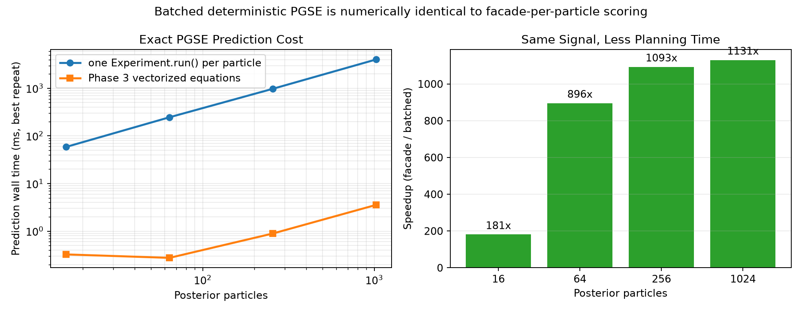
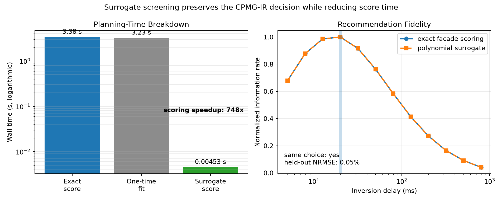
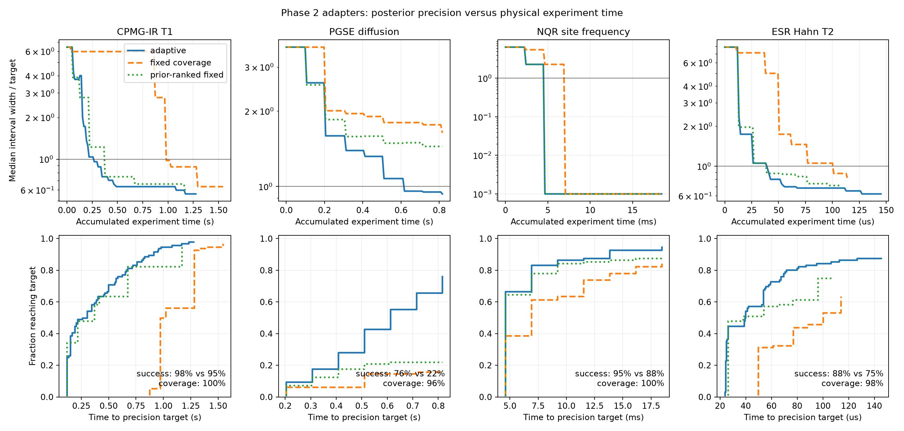

# Bayesian experiment design

Bayesian experiment design chooses the next measurement from the uncertainty
remaining after previous measurements. Use it when acquisition time is scarce,
candidate settings have different durations, or the informative region of a
relaxation, diffusion, NQR, or ESR experiment depends strongly on unknown
sample properties.

PythonSpinDynamics currently provides three levels:

- a generic NumPy core for finite candidate spaces, grid or particle
  posteriors, likelihood-based prediction, expected information gain, expected
  QoI variance reduction, costs, constraints, stopping, and checkpointing; and
- an exact-grid inversion-recovery reference that marginalizes amplitude,
  baseline, and noise while calculating information specifically about
  \(T_1\); and
- experiment-facade adapters for CPMG inversion recovery, deterministic PGSE,
  NQR FID carrier/pulse selection, and ESR Hahn delay/carrier selection.

The generic core recommends measurements and consumes results through an
`ask()`/`tell()` loop. It does not control an instrument, and its physical cost
is distinct from the simulator-runtime estimate returned by
`Experiment.plan()`.

## The five objects in an adaptive study

An adaptive session combines:

1. a posterior over uncertain parameters;
2. a predictor and observation likelihood;
3. a finite set of controllable acquisition actions;
4. a utility and physical-time cost; and
5. optional constraints and a posterior stopping rule.

The predictor must be vectorized over particles. Its returned leading dimension
must match the particle count. For scalar observations:

```python
def predict(parameters, design):
    return parameters["slope"] * design.x + parameters["offset"]
```

For a vector or complex waveform, return `(particles, samples)` and configure
the likelihood with `event_ndim=1` so the sample dimension is treated as one
observation event.

## Minimal particle example

This compact model estimates a slope while retaining an uncertain offset as a
nuisance parameter:

```python
from dataclasses import dataclass
import numpy as np

from spin_dynamics.design import (
    AdaptiveDesignSession, CallableCost, CandidateDesignSpace,
    ExpectedVarianceReduction, GaussianLikelihood, IndependentPrior,
    NormalPrior, ParticlePosterior, PredictiveModel,
)

@dataclass(frozen=True)
class Setting:
    x: float
    duration_seconds: float

prior = IndependentPrior({
    "slope": NormalPrior(0.0, 2.0),
    "offset": NormalPrior(0.0, 1.0),
})
posterior = ParticlePosterior.from_prior(
    prior, particles=4096, rng=np.random.default_rng(10)
)

def predict(parameters, design):
    return parameters["slope"] * design.x + parameters["offset"]

def target(parameters):
    return parameters["slope"]

actions = CandidateDesignSpace(
    Setting(x, 0.5 + abs(x)) for x in (-2.0, -1.0, 1.0, 2.0)
)
session = AdaptiveDesignSession(
    model=PredictiveModel(predict, GaussianLikelihood(sigma=0.2)),
    posterior=posterior,
    design_space=actions,
    utility=ExpectedVarianceReduction(target, samples=256),
    cost=CallableCost(lambda design: design.duration_seconds),
    seed=11,
)

recommendation = session.ask()
next_setting = recommendation.best.design
# Acquire next_setting externally, producing measured_value.
session.tell(next_setting, measured_value)
```

Each `CandidateScore` reports the utility estimate, its Monte Carlo standard
error, physical seconds, utility per second, feasibility, and rejection
messages. Candidates in one `ask()` evaluation use the same particle-index and
noise random stream. These common random numbers make close comparisons less
noisy without hiding the returned estimator uncertainty.

Runnable version:
[`examples/bayesian_design_linear.py`](https://github.com/supertjhok/MRSpinDynamics/blob/main/PythonSpinDynamics/examples/bayesian_design_linear.py).

## Connecting the design core to Experiment

Phase 2 adapters turn a particle and an action into a simulation-only
`Experiment`, extract a stable observable from its result, and calculate the
laboratory duration of that action. Use `make_adapter_session()` instead of
constructing `AdaptiveDesignSession` directly: it installs
`ExperimentPlanConstraint`, ensuring every candidate passes the existing
static experiment planner before its utility is scored or returned.

| Adapter | Action | Bound latent fields | Default observable | Physical cost includes |
|---|---|---|---|---|
| `CPMGIRAdapter` | `CPMGIRDesign(delay_seconds)` | sample T1 and T2 | complex echo-integral vector | inversion delay, echo train, recovery, overhead |
| `PGSEAdapter` | `PGSEDesign(G, delta, Delta)` | diffusion coefficient and T2 | complex echo vector | final echo time, recovery, overhead |
| `NQRFIDAdapter` | `NQRFrequencyDesign(carrier, pulse, nutation)` | site quadrupole frequency and eta | complex FID | pulse, acquisition, recovery, overhead |
| `ESRHahnAdapter` | `ESRDelayDesign(tau, carrier)` | sequence T2 and optional isotropic g factor | complex echo waveform | pulses, delay, acquisition, recovery, overhead |

All four adapters also recognize optional scalar `signal_scale` and `baseline`
particles. Set `echo_index` or `sample_index` to select a scalar observation;
otherwise use `ComplexGaussianLikelihood(..., event_ndim=1)` for the returned
vector. Acquisition noise must be disabled on the template because uncertainty
belongs in the explicit Bayesian likelihood.

```python
import numpy as np
from spin_dynamics.design import (
    CPMGIRAdapter, CPMGIRDesign, CandidateDesignSpace,
    ComplexGaussianLikelihood, ExpectedVarianceReduction,
    ParticlePosterior, make_adapter_session,
)
from spin_dynamics.experiment import (
    Acquisition, CPMGIRTrain, Experiment, Sample,
)

template = Experiment(
    CPMGIRTrain(num_echoes=2, echo_spacing_seconds=1e-3),
    Sample(t1_seconds=0.15, t2_seconds=0.06),
    acquisition=Acquisition(numpts=21, maxoffs=5, rephase_action="ignore"),
)
adapter = CPMGIRAdapter(
    template,
    {"t1_seconds": 0.15, "t2_seconds": 0.06},
    echo_index=0,
    recovery_seconds=20e-3,
)
t1 = np.geomspace(0.05, 0.45, 15)
posterior = ParticlePosterior({
    "t1_seconds": t1,
    "t2_seconds": np.full(t1.size, 0.06),
})
session = make_adapter_session(
    adapter=adapter,
    likelihood=ComplexGaussianLikelihood(0.5),
    posterior=posterior,
    design_space=CandidateDesignSpace(
        CPMGIRDesign(delay) for delay in np.geomspace(5e-3, 0.6, 8)
    ),
    utility=ExpectedVarianceReduction(
        lambda p: p["t1_seconds"], samples=32, scale=0.1
    ),
    seed=12,
)
next_action = session.ask().best.design
```

`ExperimentPredictor` caches deterministic workflow outputs by action and
particle values, because `ask()` and `tell()` repeatedly need the same forward
predictions. Call `clear_cache()` after changing external simulator state. The
reference adapters currently accept scalar latent parameters. CPMG-IR, NQR,
and ESR execute one facade workflow per distinct particle/action pair; the
deterministic PGSE adapter has the Phase 3 batch path described below.

Runnable examples:
[`bayesian_design_cpmg_ir_adapter.py`](https://github.com/supertjhok/MRSpinDynamics/blob/main/PythonSpinDynamics/examples/bayesian_design_cpmg_ir_adapter.py)
and
[`bayesian_design_adapter_catalog.py`](https://github.com/supertjhok/MRSpinDynamics/blob/main/PythonSpinDynamics/examples/bayesian_design_adapter_catalog.py).

## Phase 3 acceleration

Phase 3 separates cheap screening from exact refinement. These paths reduce
the computer time needed to choose an acquisition; they do not change the
laboratory duration used in the utility-rate denominator.

### Batched deterministic PGSE

`ExperimentPredictor` automatically uses `PGSEAdapter.simulate_batch()` when
available. The nominal action still passes `Experiment.plan()`, but all
diffusion/T2 particles are evaluated by the same vectorized equations used by
the deterministic moment workflow. Set `prefer_batch=False` when performing a
facade-per-particle parity audit.



The plotted benchmark checks every batched signal against the corresponding
facade result before reporting time. Absolute timings depend on the machine;
the scaling gap comes from eliminating thousands of Python dispatches and
result allocations.

### Validated surrogates and two-stage scoring

`PolynomialSurrogatePredictor.fit()` trains a ridge-stabilized response surface
from exact predictions. Scalar particle/action features work for smooth compact
ranges; `joint_encoder` can supply physics-informed or candidate-specific
features. Always call `validate()` on held-out particles and actions before a
surrogate influences a recommendation.

`LaplaceInformationGain` uses the weighted predictive covariance and Gaussian
noise scale as a fast Fisher/Laplace information approximation. Its optional
`backend="jax"` affects the eigensolve and requires the JAX extra.
`TwoStageDesignSession` evaluates this or another cheap utility for every
feasible action, then applies the requested particle estimator only to the
leading `finalists`. `AdaptiveMonteCarloUtility` is an alternative when all
candidates use nested Monte Carlo: it increases samples until the returned
standard error meets absolute or relative tolerance.



In this reproducible benchmark the response surface is trained on eight T1
values per candidate and validated over the complete 48-particle grid. The
one-time fit costs about one exact ranking, while subsequent scoring is hundreds
of times faster and selects the same delay. The script fails rather than plot a
surrogate whose numerical predictions cannot be compared with exact results.

```python
session = TwoStageDesignSession(
    model=surrogate_model,
    posterior=posterior,
    design_space=actions,
    screening_utility=LaplaceInformationGain(),
    refinement_utility=ExpectedInformationGain(samples=256),
    finalists=3,
    cost=physical_cost,
    constraints=(ExperimentPlanConstraint(adapter),),
    seed=10,
)
```

Runnable benchmarks:
[`plot_bayesian_pgse_batch_speedup.py`](https://github.com/supertjhok/MRSpinDynamics/blob/main/PythonSpinDynamics/examples/plot_bayesian_pgse_batch_speedup.py)
and
[`plot_bayesian_surrogate_screening.py`](https://github.com/supertjhok/MRSpinDynamics/blob/main/PythonSpinDynamics/examples/plot_bayesian_surrogate_screening.py).

## End-to-end Phase 2 adapter benchmarks

`make_phase2_adapter_benchmarks()` constructs matched reference problems for
all four Phase 2 adapters. `run_adapter_benchmark()` then compares three
policies in paired prior-predictive trials:

- **adaptive** re-ranks every candidate after each observation;
- **fixed coverage** cycles a declared endpoint-and-midpoint schedule; and
- **prior-ranked fixed** ranks candidates once under the prior, then freezes
  that open-loop order.

Every policy receives the same sampled truth and the same per-step noise seed
in a trial. It also uses the same likelihood, posterior support, physical cost,
90% credible interval, and stopping threshold. The synthetic truth is one of
the exact adapter-table particles, so this is an *equal-model* algorithm test:
it measures acquisition-policy efficiency when the assumed simulator is
correct, not robustness to instrument artifacts or model mismatch.



The upper row shows median posterior interval width divided by the precision
target; crossing 1 means the median trial has reached the requested precision.
The lower row shows the fraction of trials that reached that target by a given
amount of laboratory time. A curve that plateaus below 1 represents failures
to reach the target within eight actions rather than discarded trials. A
zero-width interval on the finite NQR grid is drawn at (10^{-3}) solely so it
can appear on the logarithmic axis.

The tracked 96-trial reference run produced:

| Adapter target | Adaptive success | Fixed-coverage success | Adaptive median lab time | Fixed median lab time | Adaptive 90% coverage |
|---|---:|---:|---:|---:|---:|
| CPMG-IR T1 | 97.9% | 96.9% | 0.281 s | 0.996 s | 100.0% |
| PGSE diffusion | 76.0% | 16.7% | 0.612 s | 0.816 s | 95.8% |
| NQR site frequency | 94.8% | 84.4% | 4.61 ms | 6.92 ms | 100.0% |
| ESR Hahn T2 | 87.5% | 63.5% | 39.6 us | 100.2 us | 97.9% |

These medians include unsuccessful trials at their eight-action budget. The
JSON result also reports success-conditioned time, action count, RMSE, bias,
coverage, interval width, and planning time for all three policies. In the ESR
case the prior-ranked fixed protocol has a slightly shorter median laboratory
time than adaptive among all trials, but lower success (75.0%), lower coverage
(93.8%), and higher RMSE. The benchmark preserves that tradeoff rather than
claiming uniform dominance.

Three clocks must not be conflated:

1. **physical experiment time** is the sequence, acquisition, recovery, and
   fixed overhead charged by the adapter; it is the horizontal axis above;
2. **planning wall time** is Python time spent choosing adaptive actions; and
3. **prediction-table build time** is a one-time exact-simulation setup cost
   amortized over the paired synthetic trials.

Phase 3 is used here through deterministic PGSE batching and exact prediction
reuse. It changes clocks 2 and 3, not clock 1 or the Bayesian observations.
For the fast NQR and ESR reference acquisitions, current Python planning time
is longer than the simulated physical action duration, which makes further
batching and live-instrument latency work important before deployment.

Reproduce the reference plot and machine-readable results with:

```powershell
python examples\plot_bayesian_adapter_benchmarks.py --trials 96 `
  --output results\bayesian-adapters.png `
  --json-output results\bayesian-adapters.json
```

Use `--profile smoke --trials 2` for a fast integration check. The builders,
runner, result dataclasses, and `CandidatePredictionTable` are public so new
adapter benchmarks can use the same paired protocol.

## Phase 4 batch and live operation

`LiveDesignSession` wraps an `AdaptiveDesignSession` without embedding hardware
control in the Bayesian core. A user-supplied `DesignInstrument` receives a
sequence of `AcquisitionRequest` objects and must return exactly one
`AcquisitionOutcome` per request ID. Accepted outcomes update the posterior;
rejected outcomes do not.

The Phase 4 lifecycle is deliberately transactional:

1. `plan_batch()` calls `ask()` once and selects the leading distinct feasible
   actions that have not been permanently rejected. The candidate scores,
   constraint messages, selection reasons, posterior summary, and a pending
   batch are atomically checkpointed.
2. `execute_pending()` atomically records that an instrument call is about to
   start, then invokes the external adapter.
3. The complete outcome set is validated before any observation is applied.
   Accepted observations are committed in request order, permanent rejections
   are excluded from future batches, and the completed audit/checkpoint state
   is atomically replaced.

This batch policy freezes one ranking and chooses its leading unique actions.
It is useful when the instrument cannot pause after every scan, but it is not a
joint non-myopic batch optimizer: increasing `batch_size` trades adaptation
opportunities for operational convenience.

```python
class MyInstrument:
    def acquire(self, requests):
        outcomes = []
        for request in requests:
            try:
                value, actual_seconds = acquire_from_hardware(request.design)
                outcomes.append(AcquisitionOutcome(
                    request.request_id,
                    accepted=True,
                    observation=value,
                    physical_seconds=actual_seconds,
                    metadata={"archive_id": instrument_archive_id()},
                ))
            except InterlockError as error:
                outcomes.append(AcquisitionOutcome(
                    request.request_id,
                    accepted=False,
                    reason=str(error),
                    retryable=False,
                ))
        return outcomes

live = LiveDesignSession(
    adaptive_session,
    MyInstrument(),
    batch_size=2,
    latency_budget_seconds=0.05,
    audit_quantities={"T1_seconds": lambda p: p["t1_seconds"]},
    checkpoint_path="results/live-state.json",
    audit_path="results/live-audit.json",
)
live.run(maximum_batches=4)
```

### Timing semantics

`planning_seconds` is measured wall time spent ranking actions.
`latency_budget_seconds` is an operational threshold and
`latency_exceeded_batches` counts overruns. `physical_seconds` uses the actual
duration reported by the instrument, falling back to the adapter cost for an
accepted result. `total_operational_seconds` adds planning time only when
`planning_can_overlap=False`. These live clocks do not change the utility-rate
cost used when the candidates were ranked.

The synthetic CPMG-IR instrument example makes this distinction visible. On a
representative run its first uncached plan took seconds while the physical
two-action batch took milliseconds; the next cached ranking took about 10 ms.
This is precisely why planner latency is now recorded rather than hidden.

```powershell
python examples\bayesian_design_live_instrument.py --batches 3 --batch-size 2 `
  --checkpoint results\bayesian-live-state.json `
  --audit results\bayesian-live-audit.json
```

### Recovery after interruption

The live checkpoint is written before external I/O. If an instrument call
raises, its pending batch has `attempt_count > 0`: the hardware might have
completed the acquisition even though Python did not receive the reply.
Restored sessions therefore refuse automatic execution. Reconcile archived
instrument results with `resolve_pending(outcomes)`, or use
`execute_pending(allow_retry=True)` only after deciding that a duplicate
acquisition is safe. Stable request IDs should also be used as idempotency keys
when the instrument API supports them.

`save_design_state_atomic()` provides the same flush-and-replace checkpoint
primitive for custom loops. It creates the temporary file beside the target,
flushes it, and uses a same-filesystem atomic replacement so a failed write
does not truncate the previous checkpoint.

## Robustness and nuisance parameters

`ExpectedTargetInformationGain` estimates information about a *discrete*
target label while marginalizing particles that share that label. This covers
model identity, material class, or a discretized output without rewarding
measurements that determine only nuisance variables. Continuous target-only
mutual information still requires a validated conditional-density estimator.

`GaussianDiscrepancyLikelihood` and
`ComplexGaussianDiscrepancyLikelihood` add independent measurement and model
discrepancy variances explicitly. `ModelMixturePredictor` dispatches particles
according to an integer `model_index`, keeping model uncertainty inside the
posterior. `analyze_design_sensitivity()` repeats a recommendation under named
prior/model scenarios and reports the modal action and agreement fraction.

These diagnostics do not certify a surrogate or physical model. Treat a changed
recommendation under plausible priors, discrepancy scales, held-out validation
sets, or model components as a reason to acquire a robust action or return to
the exact simulator.

## Grid and particle posteriors

Use `GridPosterior` when a small Cartesian parameter grid is affordable. Its
Bayesian update is exact on that grid and `marginal(name)` returns an exact
discrete marginal. It is the preferred reference for one to roughly three
low-cardinality uncertain parameters.

Use `ParticlePosterior` for broader, non-Cartesian parameter sets. Construct it
directly or draw from `IndependentPrior`, whose scalar components currently
include normal, uniform, log-uniform, and discrete distributions. Updates are
importance-weight updates. `effective_sample_size` diagnoses degeneracy, and
an adaptive session can perform systematic resampling below a configured ESS
fraction.

Resampling duplicates and discards particles; it does not rejuvenate them.
Long or sharply informative studies will eventually require MCMC, kernel, or
flow-based rejuvenation. Until that is implemented, inspect ESS and verify the
result against a denser initial sample or small grid whenever possible.

## Choosing the utility

`ExpectedInformationGain` estimates

\[
I(\Theta;Y\mid d,H),
\]

in nats for the *complete latent particle state*. This is appropriate when all
represented parameters matter, or for model calibration before the downstream
goal has been narrowed.

`ExpectedVarianceReduction` estimates the expected reduction in squared-error
Bayes risk for a scalar or vector quantity

\[
z=q(\Theta).
\]

Use it when only selected sample properties or derived outputs matter. Its
`scale` argument nondimensionalizes vector components before variances are
summed. Unlike full-state EIG, this utility does not reward learning a nuisance
parameter unless that learning reduces uncertainty in the chosen output.

Full-state EIG does not marginalize nuisance state. Phase 3
`ExpectedTargetInformationGain` performs the nested marginal calculation for
discrete target labels, while the inversion-recovery reference remains the
exact-grid continuous-T1 oracle. A general continuous target still requires a
validated conditional-density estimator.

Both Monte Carlo utilities may return a slightly negative estimate when their
true expected value is near zero. Use the standard error to decide whether
candidate differences are resolved; do not silently clamp generic estimates.

## Costs, constraints, and stopping

`ConstantCost` applies one duration to every action. `CallableCost` derives
physical seconds from the action. Include sequence duration, repetitions,
recovery, switching, and non-overlapped computation where applicable. Do not
substitute Python simulator runtime.

`CallableConstraint` rejects unsafe or unrealizable actions and attaches a
reason. All constraints are evaluated so the recommendation retains a complete
audit of rejected candidates.

`CredibleIntervalStopping` and `PosteriorStandardDeviationStopping` operate on
the same QoI functions used by risk utilities. `session.should_stop()` is false
when no rule is configured.

## Checkpoints and reproducibility

`session.state_dict()` stores posterior state, candidate indices, observations,
the random-generator state, resampling configuration, and evaluation count.
Use `save_design_state()` and `load_design_state()` for JSON files. Restoring a
session requires the model, candidate space, utility, cost, constraints, and
stopping rule again because arbitrary executable callables are not embedded in
the checkpoint.

```python
from spin_dynamics.design import save_design_state

save_design_state("results/design-state.json", session.state_dict())
```

Checkpoint candidate indices are stable only if the reconstructed
`CandidateDesignSpace` has the same ordering. The restore operation checks its
candidate count; application-level provenance should additionally identify the
action definitions and model version.

## Inversion-recovery reference

`IRGridPosterior` and `IRAdaptiveSession` retain the Phase 0 calculation

\[
y=b+A(1-2e^{-\tau/T_1})+\epsilon,
\qquad \epsilon\sim\mathcal N(0,\sigma^2/r).
\]

Unlike generic full-state EIG, it evaluates \(I(T_1;Y)\) while exactly
marginalizing the nuisance-grid dimensions. Use it to validate future generic
target-EIG estimators and to reproduce the synthetic benchmark in
`examples/bayesian_ir_phase0.py`.

## Scope and next integration step

Phase 4 provides a synchronous external-instrument boundary, small open-loop
batches, explicit planner latency, atomic recovery state, rejected-acquisition
handling, and JSON audit records. It is not a vendor driver, scheduler, remote
transport, safety system, or non-myopic batch optimizer. A real integration
must still supply calibrated observation parsing, authentication, timeouts,
hardware safety, and instrument-side idempotency.

The research basis, formal objective, robustness concerns, phased roadmap, and
full references are preserved in the
[Bayesian experiment-design architecture plan](../bayesian_experiment_design_plan.md).
