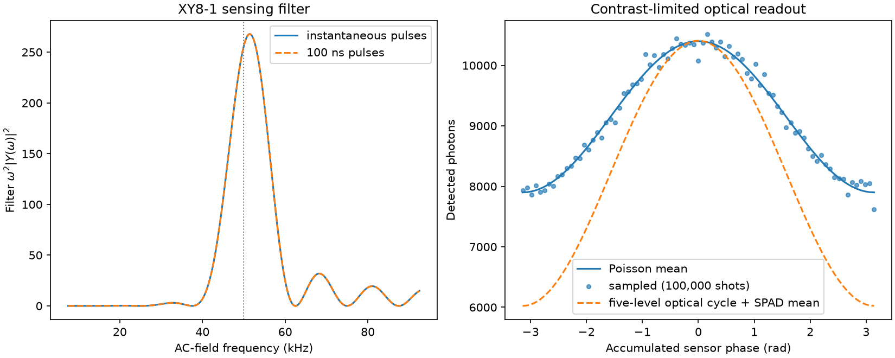

# User Manual

The pages in this site are the searchable web edition of the
PythonSpinDynamics manual. Start with [Concepts and Units](concepts.md), then use
the [Unified Experiment Workflow](experiment_workflow.md) and
[Examples](examples.md) for practical work. The navigation follows the same
task-to-model flow as the print edition:

1. orientation and experiment planning;
2. experiments, sequences, and imaging;
3. coupled-spin, NQR, ESR, defect-spin nano-MR, optical detection, relaxation,
   and spatial physics;
4. fields, hardware, and image-guided magnetic therapy;
5. pulse design and optimization; and
6. API and validation reference.

The [API Reference](api_reference.md) and
[Validation Evidence](validation.md) document the implemented surface and the
evidence behind it.

If the distinction between a workflow, model reference, design note, and
generated evidence page is unclear, begin with
[How to Use This Documentation](../documentation_map.md).

[Download the PDF print edition](../user_manual.pdf){ .md-button .md-button--primary }

The PDF preserves the equation-rich, paginated reference manual and is also
attached to each workspace release. Site search indexes the web pages rather
than the PDF's internal text. Material that currently exists only in the PDF
will be migrated into shared Markdown sources over time so the web and print
editions converge without maintaining two independent explanations.

## Illustrated example results

These figures are generated by runnable scripts in `examples/`; the print
edition places each one beside the corresponding model discussion.

### NQR to quadrupolar-NMR crossover

Exact diagonalization reveals how energy levels, transition frequencies, and
intensities evolve through the difficult intermediate regime. Reproduce it with
`python examples/plot_nqr_nmr_crossover.py --output crossover.png`.

### Multinuclear ZULF coupling

The full multinuclear Hamiltonian shows resolved coupling, relaxation-driven
coalescence, and quadrupolar self-decoupling without imposing a high-field
secular approximation.

### Probe response in CPMG

The normalized spin response can remain similar even when the received signal
and SNR differ substantially. Reproduce it with
`python examples/plot_probe_cpmg.py --output probe_cpmg.png`.

### Molecular motion and BPP relaxation

The plot connects a molecular correlation-time model to observable relaxation
times and identifies the motional regime.

### ESR powder spectra

Field- and frequency-swept views are built from the same weighted powder
orientations, making the source of the broadened spectrum explicit.

### Defect-spin nano-MR and optical detection

The dedicated [nano-MR and optical-detection chapter](nano_mr.md) connects
diamond NV-minus and 4H-SiC PL6 ground-state physics to phase-aware sensing
sequences, finite-pulse filters, effective optical photon counts, and
statistical nuclear baths.

The statistical-spectrum example resolves proton and fluorine Larmor peaks and verifies the
analytic \(d^{-3}\) half-space field-variance law. Reproduce it with
`python examples/plot_nano_mr_statistical_spectra.py --output nano_mr.png`.

The diffusing-liquid trajectory workflow reuses the general Brownian/advection and
boundary engine, then evaluates the precessing nuclear dipolar field at the
sensor. It provides reproducible field records, correlations, periodogram or
Welch spectra, and displacement checks for free diffusion, drift, and
confinement.

The scanning nano-MRI workflow treats scanning probes and fixed sensor arrays
through one geometry, builds coherent-field or statistical-variance dipolar
operators, and supports analytic depth profiling, nonnegative regularized
density inversion, bounded sparse point-source localization, and local
uncertainty estimates.

The stochastic-acquisition workflow keeps target nuclear
fluctuations separate from sensor-surface noise, preserves temporal and
cross-pixel covariance, follows the optical triplet/singlet/charge-state rate
model shot by shot, and transfers emitted photons through an explicit SPAD.
The imaging solver can use the resulting covariance through generalized least
squares while retaining the original scalar-noise interface.

The clocked-acquisition layer evaluates the coherent field through the
actual sensing-sequence toggling integral. Qdyne exposes the beat-frequency
record and Fourier-bin scaling, while synchronized I/Q readout retains the
beat sign. Sensor coherence, sample coherence, diffusion, ancillary-memory
coherence, and clock error remain separate reported parameters.

The coherent-spectrum workflow uses thermally grounded amplitudes, sample and
diffusion coherence, first-order chemical shifts and scalar couplings, and an
explicit clock timebase. Optional DNP is shown as bounded polarization
build-up followed by nuclear-T1 relaxation rather than as an unexplained
readout gain.

The experiment facade binds the analytic planar statistical-spectrum and coherent Qdyne
engines to the unified experiment facade. Compact defect/layer/optical specs
round-trip through TOML and provenance-bearing archives, while a
planner-validated Bayesian adapter selects Qdyne reference frequency or
sensing duration without double-counting photon noise.

### Sequence timing

The sequence timeline exposes overlaps, delays, gradient polarity, and the ADC
window before simulation or hardware compilation.

### Balanced SSFP field sensitivity

The example connects the steady-state frequency and flip-angle responses to
B0 banding and B1 shading in images, then shows the phase-cycled correction.

### Receiver arrays and Cartesian SENSE

The [receiver-array](../receiver_array_imaging.md) and
[Cartesian SENSE](../sense_imaging.md) guides preserve complex B1- channel
phase, combine correlated-noise channels with Roemer weighting, and unfold an
R=2 acquisition while reporting encoding rank, conditioning, and g-factor.

### Loaded and matched birdcage reception

The [birdcage guide](../birdcage_coils.md) connects explicit rung/end-ring
geometry to quadrature fields, resonant circuits, branch mutual and conductive
loading, measured/assumed unloaded-Q calibration, physical 50-ohm ports,
reciprocal B1- maps, passive covariance, and noise-aware reconstruction.

### Coil geometry to RF performance

The solenoid example closes the loop from geometry to inductance, AC loss,
quality factor, self-resonance, and probe loading.

### Image-guided magnetic therapy

The therapy workflow now has a dedicated
[system guide](../image_guided_magnetic_therapy.md) connecting nonlinear EPM
imaging, particle transport, feedback control, dynamic trapping, and the
coil/EPM/hybrid hardware trade. The figure compares particle orientation memory
and concentration stability while keeping inferred actuator assumptions
visible.

### Single-sided NMR fields

The NMR-MOUSE example carries permanent-magnet and surface-coil fields into a
depth-resolved sensitive slice, exposing the field and gradient tradeoffs with
distance from the sensor.

### Restricted-diffusion diffraction

Confinement produces q-space minima instead of the monotonic attenuation of
free diffusion. The fast reproducer uses `--method sgp-propagator`; the
`walker-sweep` mode adds finite-pulse effects.

### Radiation damping

The nonlinear probe feedback changes both the transverse envelope and
longitudinal recovery on the radiation-damping time scale.

### Relaxation exchange spectroscopy

The forward signal and inverse-Laplace map distinguish diagonal population from
off-diagonal exchange during the mixing interval.

### SQUID detection at ultra-low field

A common field-referred noise model reveals why SQUID detection gains relative
to a Faraday coil as the precession field falls and the line narrows.

## Other useful entry points

- [NQR-to-NMR crossover and powder relaxation](nqr.md)
- [Defect-spin nano-MR and optical detection](nano_mr.md)
- [Workflow catalog](workflows.md)
- [Image-guided magnetic therapy](../image_guided_magnetic_therapy.md)
- [Electropermanent hardware and field models](../electropermanent_magnets.md)
- [Coils and quasistatic field solvers](../field_solvers_quasistatic.md)
- [Receiver arrays and CPMG imaging](../receiver_array_imaging.md)
- [Cartesian SENSE imaging](../sense_imaging.md)
- [Coupled receiver networks and LNA front ends](../receiver_networks.md)
- [Birdcage coils and loaded reception](../birdcage_coils.md)
- [Known gaps](known_gaps.md)
- [Validation results](../validation_results.md)
