# User Manual

The pages in this site are the searchable web edition of the
PythonSpinDynamics manual. Start with [Concepts and Units](concepts.md), then use
the [Unified Experiment Workflow](experiment_workflow.md) and
[Examples](examples.md) for practical work. The [API Reference](api_reference.md)
and [Validation Evidence](validation.md) document the implemented surface and
the evidence behind it.

[Download the PDF print edition](../user_manual.pdf){ .md-button .md-button--primary }

The PDF preserves the equation-rich, paginated reference manual and is also
attached to each workspace release. Site search indexes the web pages rather
than the PDF's internal text. Material that currently exists only in the PDF
will be migrated into shared Markdown sources over time so the web and print
editions converge without maintaining two independent explanations.

## Illustrated example results

These figures are generated by runnable scripts in `examples/`; the print
edition places each one beside the corresponding model discussion.

### NQR to quadrupolar-NMR crossover

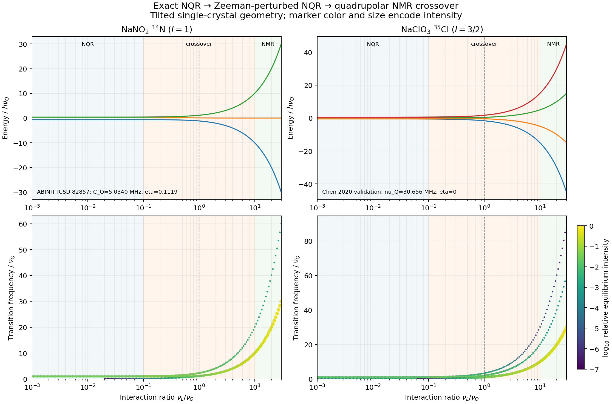

Exact diagonalization reveals how energy levels, transition frequencies, and
intensities evolve through the difficult intermediate regime. Reproduce it with
`python examples/plot_nqr_nmr_crossover.py --output crossover.png`.

### Multinuclear ZULF coupling

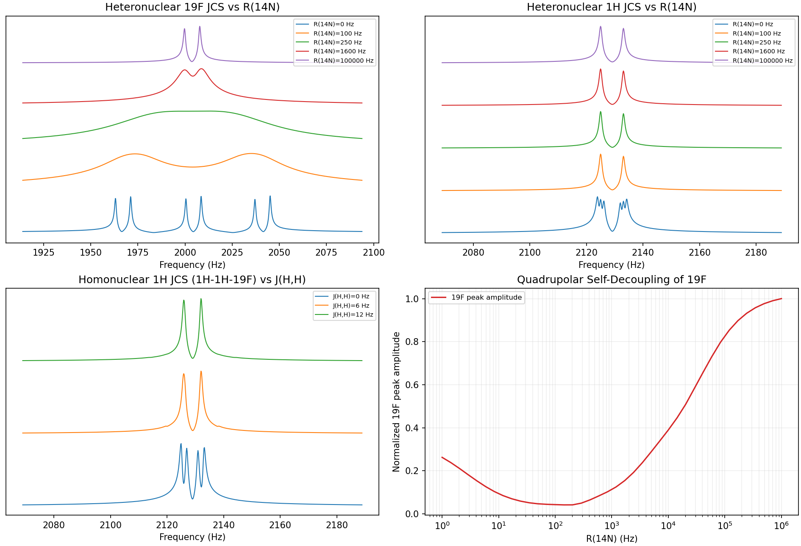

The full multinuclear Hamiltonian shows resolved coupling, relaxation-driven
coalescence, and quadrupolar self-decoupling without imposing a high-field
secular approximation.

### Probe response in CPMG

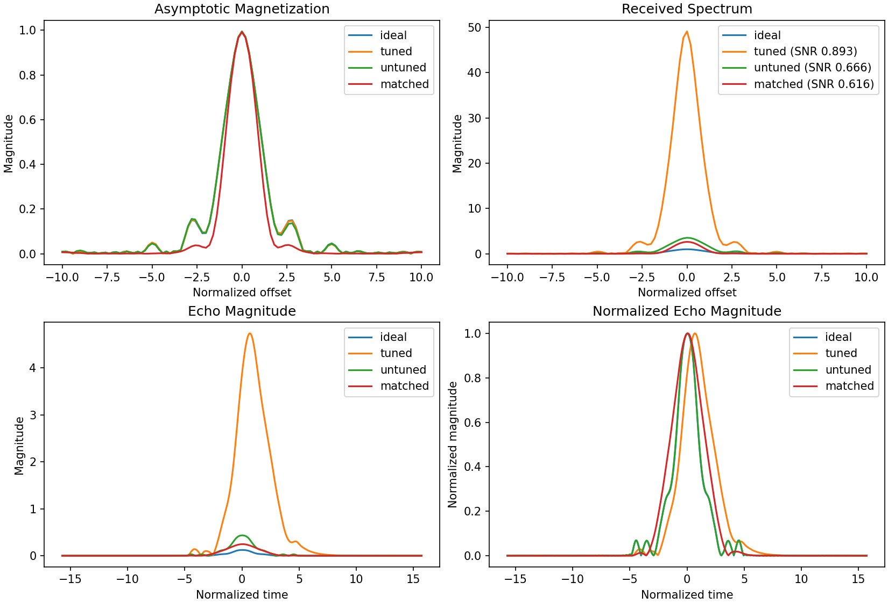

The normalized spin response can remain similar even when the received signal
and SNR differ substantially. Reproduce it with
`python examples/plot_probe_cpmg.py --output probe_cpmg.png`.

### Molecular motion and BPP relaxation

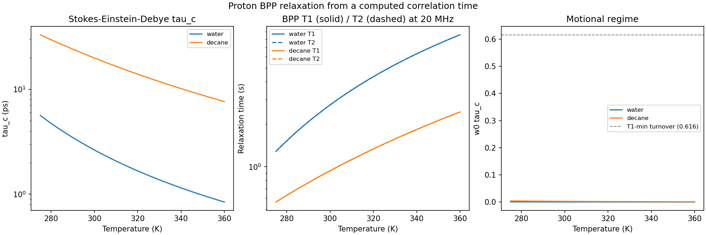

The plot connects a molecular correlation-time model to observable relaxation
times and identifies the motional regime.

### ESR powder spectra

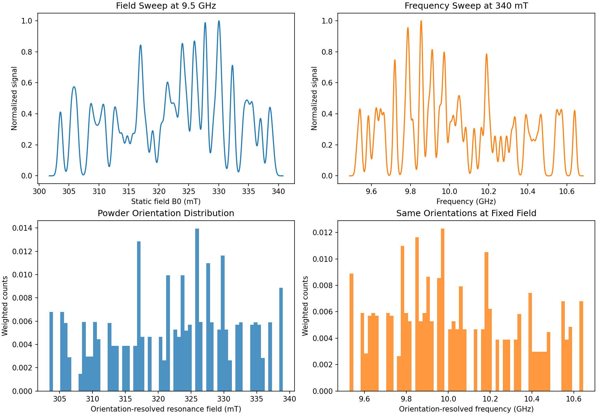

Field- and frequency-swept views are built from the same weighted powder
orientations, making the source of the broadened spectrum explicit.

### Sequence timing

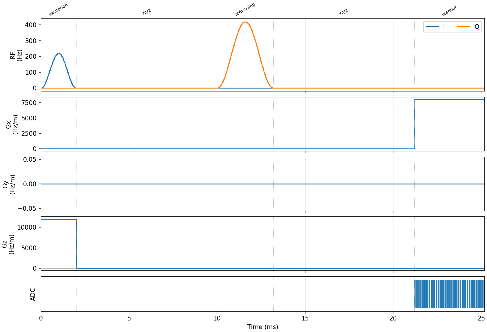

The sequence timeline exposes overlaps, delays, gradient polarity, and the ADC
window before simulation or hardware compilation.

### Balanced SSFP field sensitivity

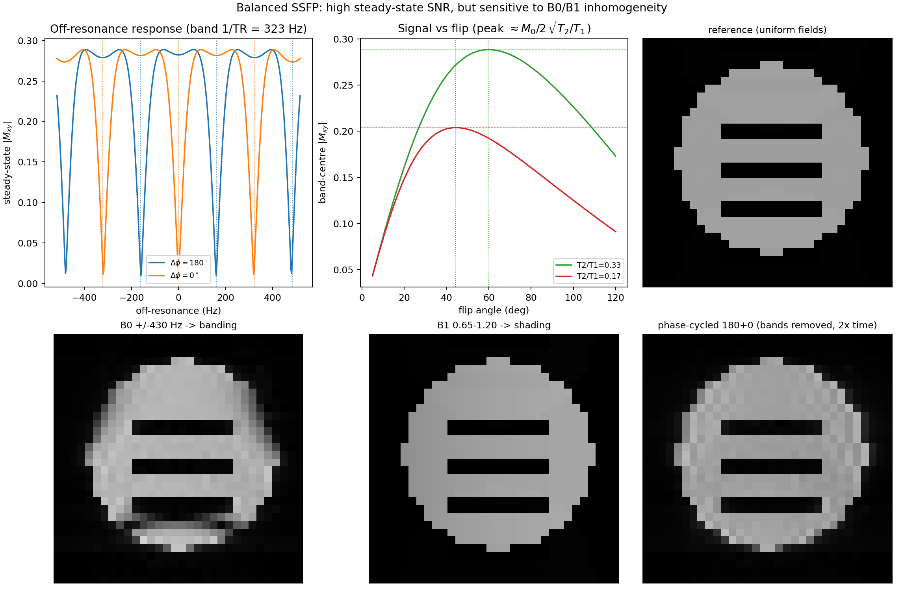

The example connects the steady-state frequency and flip-angle responses to
B0 banding and B1 shading in images, then shows the phase-cycled correction.

### Coil geometry to RF performance

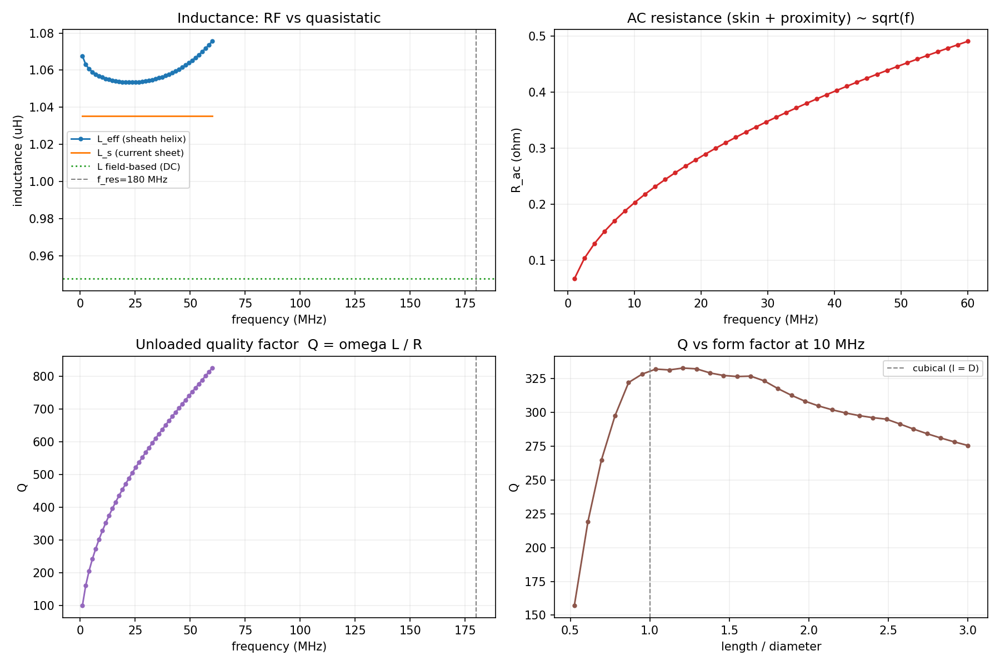

The solenoid example closes the loop from geometry to inductance, AC loss,
quality factor, self-resonance, and probe loading.

### Single-sided NMR fields

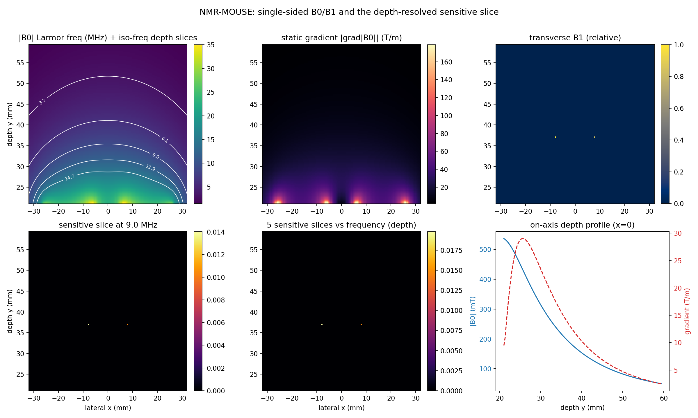

The NMR-MOUSE example carries permanent-magnet and surface-coil fields into a
depth-resolved sensitive slice, exposing the field and gradient tradeoffs with
distance from the sensor.

### Restricted-diffusion diffraction

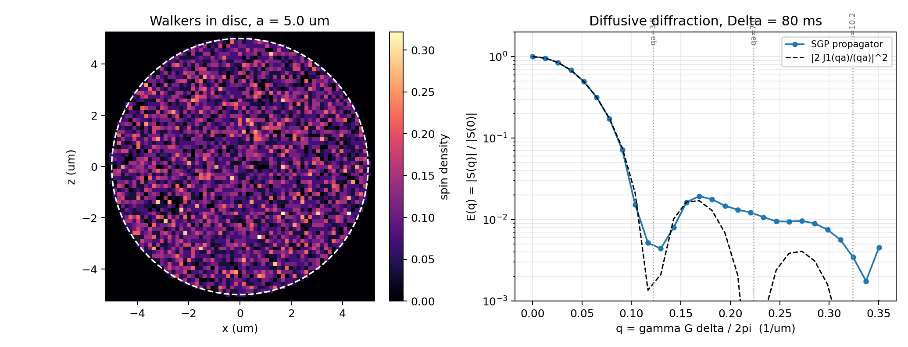

Confinement produces q-space minima instead of the monotonic attenuation of
free diffusion. The fast reproducer uses `--method sgp-propagator`; the
`walker-sweep` mode adds finite-pulse effects.

### Radiation damping

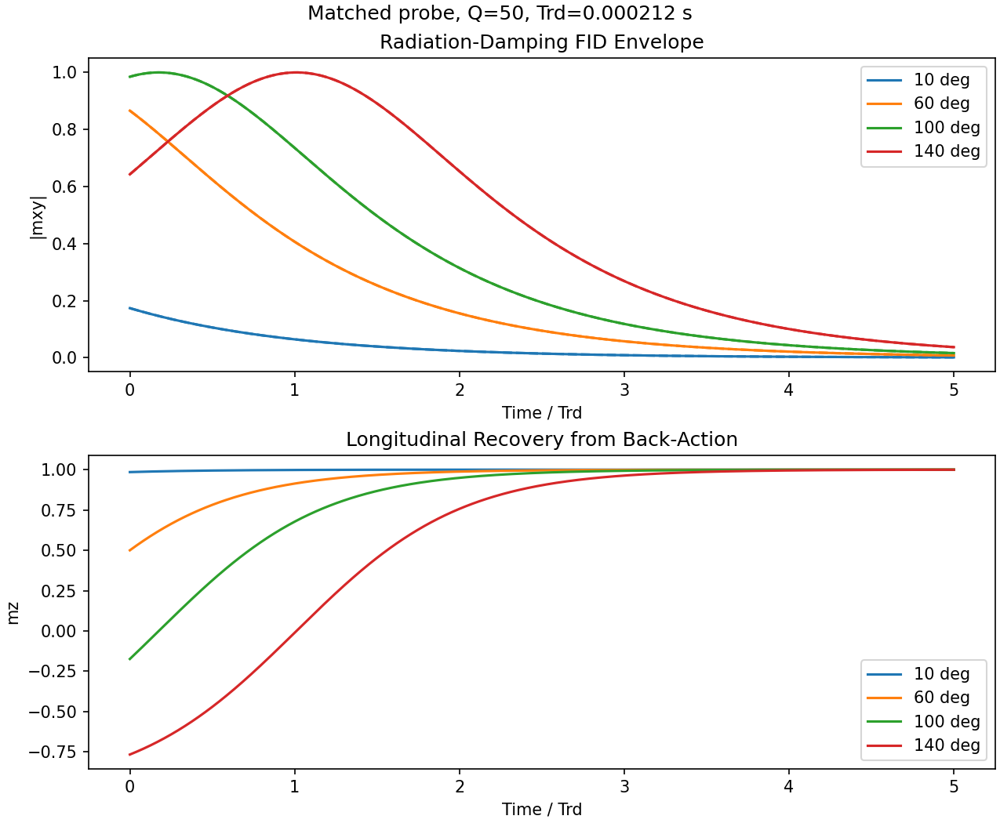

The nonlinear probe feedback changes both the transverse envelope and
longitudinal recovery on the radiation-damping time scale.

### Relaxation exchange spectroscopy

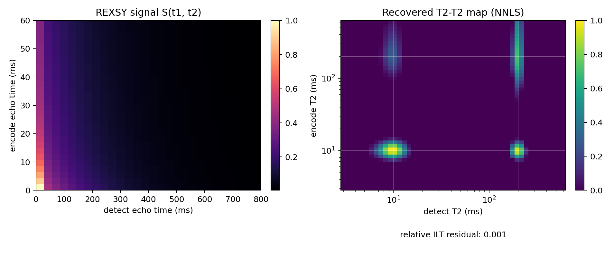

The forward signal and inverse-Laplace map distinguish diagonal population from
off-diagonal exchange during the mixing interval.

### SQUID detection at ultra-low field

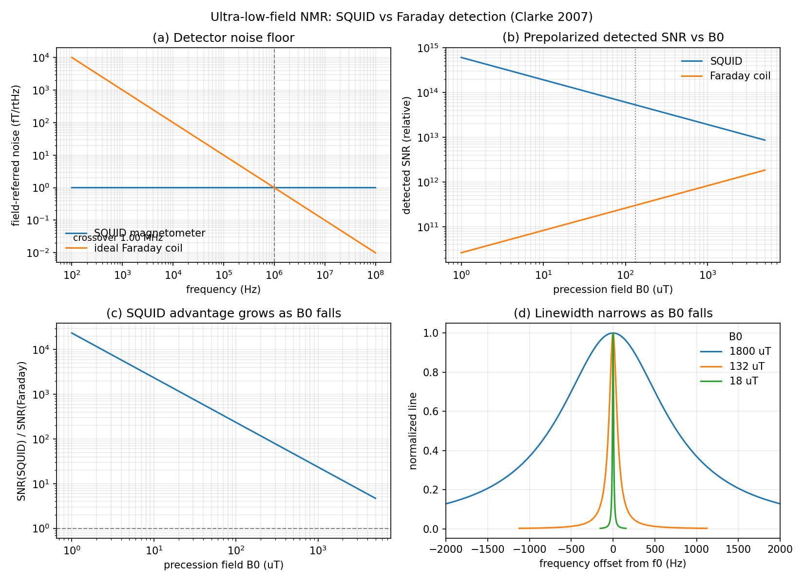

A common field-referred noise model reveals why SQUID detection gains relative
to a Faraday coil as the precession field falls and the line narrows.

## Other useful entry points

- [NQR-to-NMR crossover and powder relaxation](nqr.md)
- [Workflow catalog](workflows.md)
- [Fields and hardware models](../field_solvers_quasistatic.md)
- [Known gaps](known_gaps.md)
- [Validation results](../validation_results.md)
