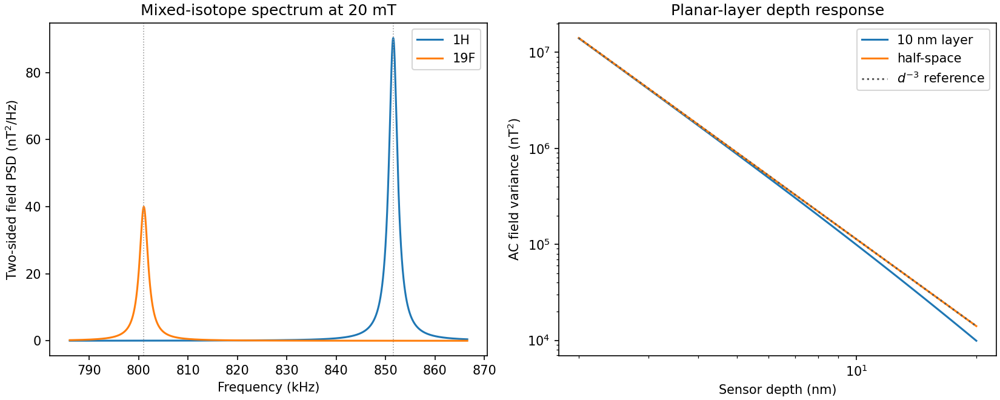
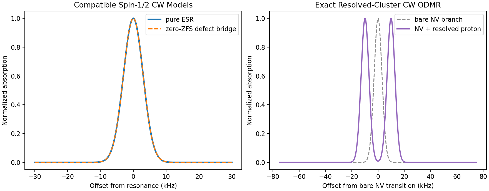
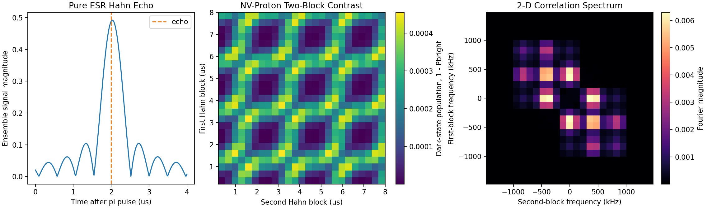
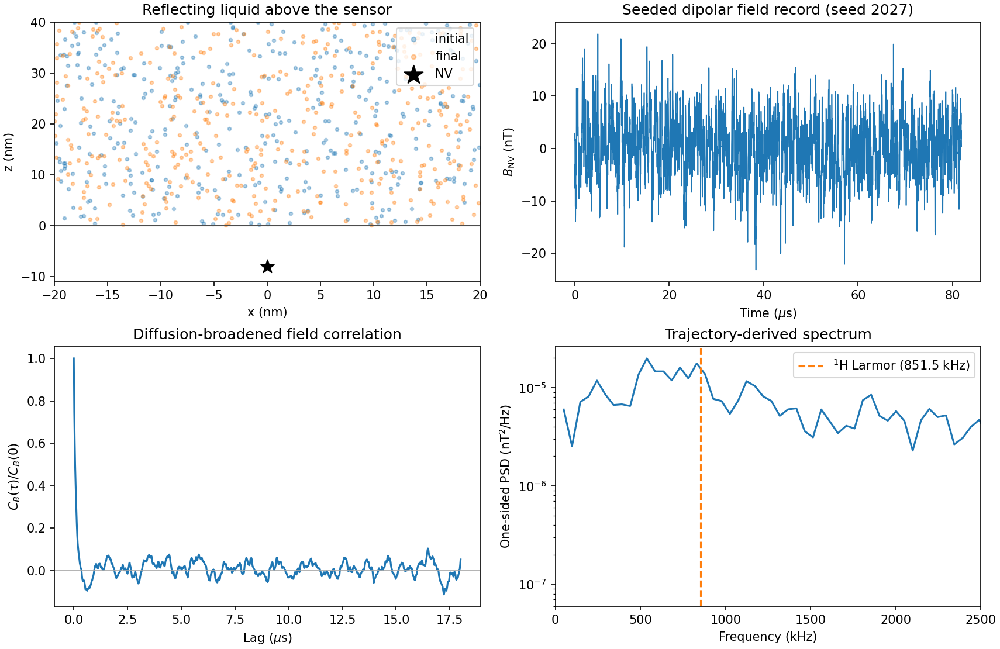
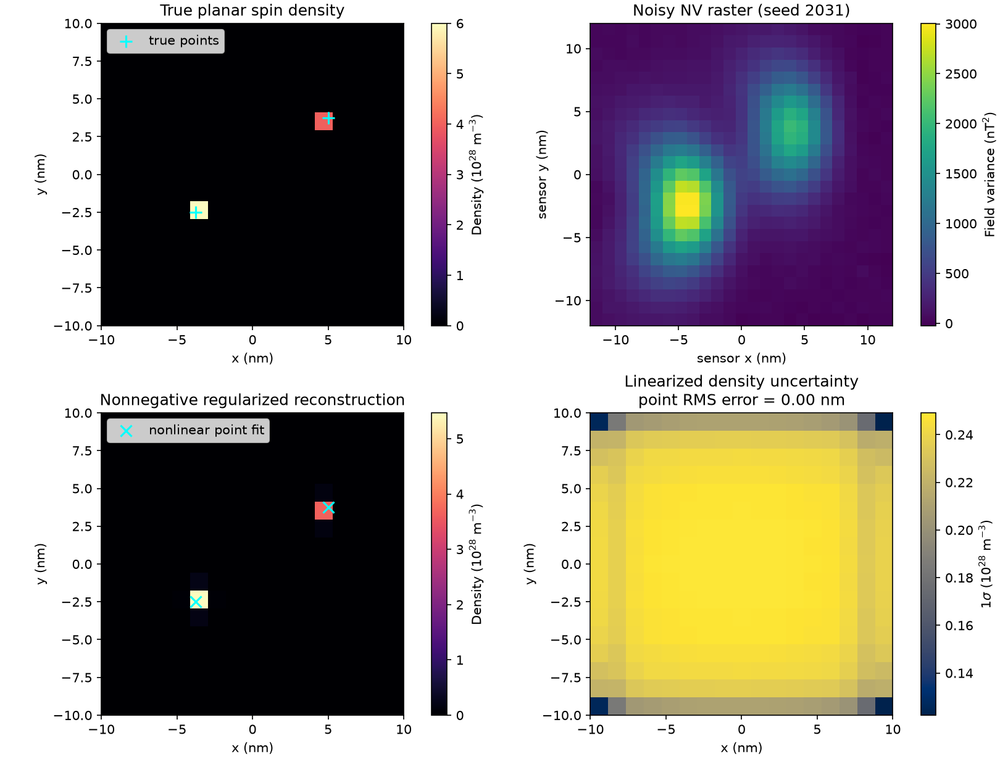
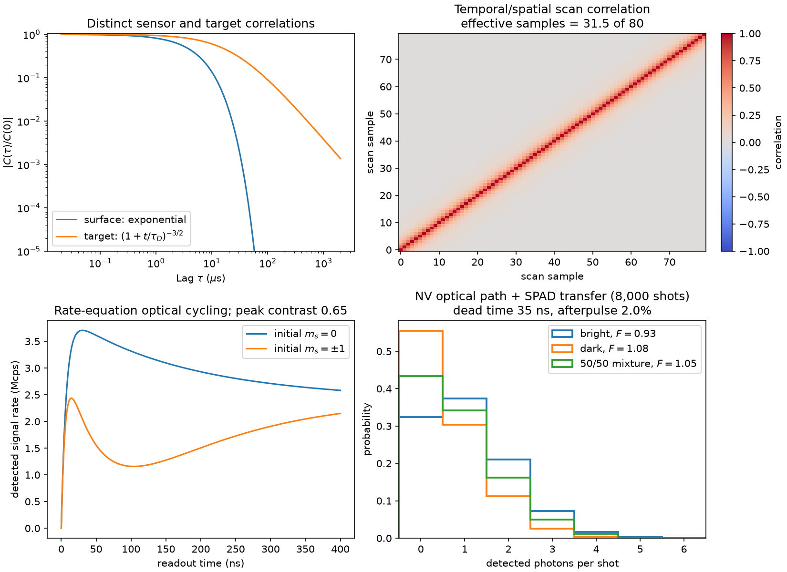
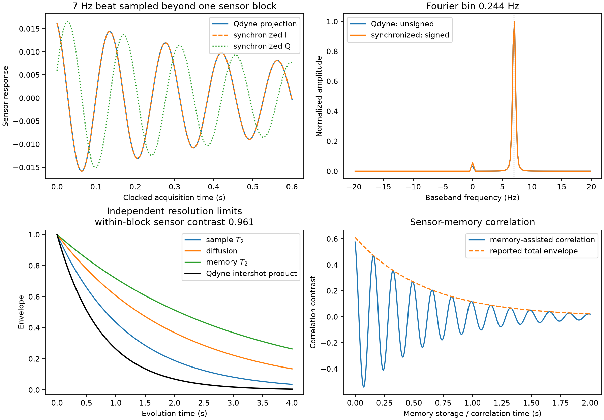
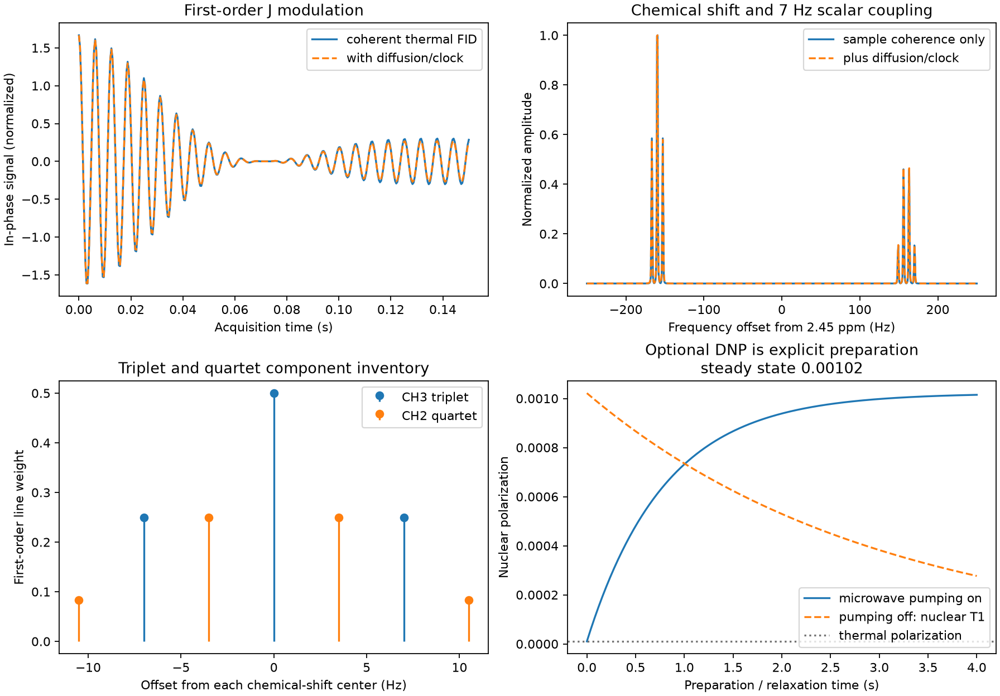

# Nanoscale Magnetic Resonance with Defect Spins

The `spin_dynamics.nano_mr` namespace models optically addressable defect
sensors used for nanoscale spectroscopy and MRI. It provides diamond NV-minus
and 4H-SiC PL6 ground-state models, coordinate frames, ODMR, surfaces, and
point-dipole electron-nuclear tensors. Its control layer includes phase-aware
schedules, ideal and finite-width filter functions, an addressed-qubit
propagator, and optical photon-count readout. Statistical-bath tools cover
thermal and fixed-polarization populations, analytic layers and half-spaces,
arbitrary voxel densities, multi-isotope spectra, and Gaussian filter-overlap
coherence. Complementary backends handle exact small resolved clusters,
nuclear RF, CW transitions, two-block 2-D correlation spectroscopy, seeded
Brownian/advection trajectories, confinement, dipolar field records, and
correlation spectra. Imaging tools support scanning sensors and sensor arrays,
depth-profile operators, nonnegative density inversion, sparse point
localization, and local uncertainty estimates. Shot-resolved acquisition adds
correlated target/sensor fields, triplet/singlet/charge optical cycling, SPAD
transfer, raw shot records, and covariance-aware inversion. High-resolution
tools add Qdyne, synchronized quadratures, independent coherence/clock budgets,
sensor-memory correlations, coherent chemical-shift/J spectra, and effective
DNP. Common statistical-spectrum and Qdyne paths also integrate with the
experiment facade, TOML configuration, result archives, and Bayesian design.
Calibration fitting, additional detector types, and microscopic memory/DNP
dynamics remain discussed in the
[literature review and implementation plan](../nano_mr_plan.md).

## Defect presets

```python
from spin_dynamics.nano_mr import (
    diamond_nv_minus,
    diagonalize_sensor,
    sic_pl6,
)

nv = diamond_nv_minus(depth_nm=5.0, axis_lab=(0.0, 0.0, 1.0))
pl6 = sic_pl6(depth_nm=2.0, axis_lab=(0.0, 0.0, 1.0))

nv_levels = diagonalize_sensor(nv, b0_vector_tesla_lab=(0.0, 0.0, 5e-3))
pl6_levels = diagonalize_sensor(pl6)
```

Both presets are ordinary `DefectSpinSensor` instances. Their ZFS and `g`
parameters can be overridden when calibrated values are available for a
particular device.

## Frames and surfaces

Rotation matrices map local defect components into the laboratory frame.
`CoordinateFrame.from_z_axis` provides a deterministic zero-roll frame when
only the defect symmetry axis is known.

```python
from spin_dynamics.nano_mr import SurfaceGeometry

surface = SurfaceGeometry(
    point_lab_nm=(0.0, 0.0, 0.0),
    normal_lab=(0.0, 0.0, 1.0),  # host toward sample
)
sensor_position_nm = surface.sensor_position_lab_nm(nv)
```

The surface normal points out of the host and into the sample, so a sensor at
positive depth lies in the opposite direction.

## Point-dipole coupling

```python
from spin_dynamics.nano_mr import (
    NuclearSpin,
    point_dipolar_hyperfine_tensor_hz,
)

proton = NuclearSpin.from_isotope("1H", position_lab_nm=(0.0, 0.0, 1.0))
A_hz = point_dipolar_hyperfine_tensor_hz(
    nv,
    proton,
    sensor_position_lab_nm=sensor_position_nm,
)
```

The returned tensor uses defect-local electron-spin rows and laboratory-frame
nuclear-spin columns:

```text
H / h = S_local^T A I_lab
```

It includes only the through-space point-dipole interaction. Contact hyperfine
coupling and surface-mediated corrections are outside the current model.

## Control sequences

Ramsey, Hahn, CPMG, XY4/8/16, KDD, and arbitrary phase-cycled schedules use a
coherent sensing window in seconds. Microwave and nuclear-RF pulses occupy
independent channels, so simultaneous events are representable.

```python
from spin_dynamics.nano_mr import (
    TimedControlPulse,
    with_nuclear_rf_pulses,
    xy_sequence,
)

xy8 = xy_sequence(
    8,
    repetitions=2,
    total_duration_seconds=80e-6,
    pulse_duration_seconds=100e-9,
)
rf_pi = TimedControlPulse(
    center_seconds=40e-6,
    duration_seconds=10e-6,
    flip_angle_rad=3.141592653589793,
    channel="nuclear_rf",
)
schedule = with_nuclear_rf_pulses(xy8, [rf_pi])
```

### KDD and UDD serve different purposes

`udd_pulse_times` uses nonuniform Uhrig timing to cancel progressively higher
orders of low-frequency pure dephasing for ideal pulses. It is principally a
pulse-placement prescription. `kdd_sequence` instead keeps equally spaced
pulse centers and uses a 20-pulse Knill phase cycle to suppress systematic
flip-angle and off-resonance errors while preserving arbitrary transverse
states.

```python
from spin_dynamics.nano_mr import kdd_sequence
from spin_dynamics.sequences import udd_pulse_times

kdd = kdd_sequence(
    repetitions=1,
    total_duration_seconds=400e-6,
    pulse_duration_seconds=100e-9,
)
udd_centers = udd_pulse_times(20, 400e-6)
```

For ideal instantaneous pulses under purely longitudinal dephasing, pulse
phase does not change the toggling function. A KDD-20 cycle therefore has the
same scalar filter as any equally spaced 20-pulse train; its advantage appears
only in phase-aware propagation with realistic pulse errors. KDD buys that
robustness with a 20-pulse cycle, whereas UDD can target a chosen cancellation
order with fewer, nonuniformly spaced pulses.

The addressed-qubit compiler acts on the selected sensor transition. It retains
nuclear-RF events in the source schedule but does not yet propagate a coupled
sensor-nuclear Hilbert space.

## Filter functions and propagation

For longitudinal dephasing, the modulation function is \(y(t)\) and

\[
Y(\omega)=\int_0^T y(t)e^{i\omega t}\,dt,\qquad
F(\omega)=\omega^2|Y(\omega)|^2.
\]

The ideal model flips \(y(t)\) instantaneously. The finite rectangular-pulse
model uses the continuous cosine rotation of the longitudinal operator.

```python
import numpy as np

from spin_dynamics.nano_mr import (
    dephasing_filter_function,
    propagate_controlled_qubit,
)

omega = 2 * np.pi * np.linspace(10e3, 200e3, 500)
ideal_filter = dephasing_filter_function(xy8, omega)
finite_filter = dephasing_filter_function(
    xy8,
    omega,
    pulse_model="finite",
)

result = propagate_controlled_qubit(
    xy8,
    detuning_rad_per_s=lambda t: 2 * np.pi * 300 * np.cos(omega[100] * t),
    max_step_seconds=25e-9,
)
sensor_coherence = result.coherence
```

The propagator uses the rotating-frame addressed-qubit Hamiltonian
\(H(t)=\delta(t)\sigma_z/2+H_\mathrm{control}(t)\), in radians per second. It
is intended for control/filter validation and compact sensing simulations, not
as a replacement for the full spin-1 defect Hamiltonian.

## Optical initialization and readout

Optical operations are represented as effective non-unitary preparation and
measurement windows. The model includes initialization fidelity, bright-state
count rate, dark-state contrast, background, readout duration, dead time, and
Poisson shot noise.

```python
from spin_dynamics.nano_mr import (
    OpticalReadoutModel,
    sample_optical_readout,
)

readout = OpticalReadoutModel(
    initialization_fidelity=0.95,
    bright_count_rate_hz=250e3,
    readout_contrast=0.25,
    readout_seconds=400e-9,
    background_count_rate_hz=10e3,
)
counts = sample_optical_readout(
    readout,
    bright_probability=[0.0, 0.5, 1.0],
    repetitions=100_000,
    sensing_seconds=xy8.total_duration_seconds,
    seed=7,
)
```

`counts.effective_bright_probability` applies the preparation map \(p'_b=\tfrac12+(2F_\mathrm{init}-1)(p_b-\tfrac12)\) before computing `counts.expected_counts`; `counts.sampled_counts` is a reproducible draw when a seed is supplied.

## Statistical nuclear baths

`NuclearBathSpecies` separates isotope identity from polarization and
correlation physics:

- `statistical` uses equal Zeeman-level populations;
- `thermal` computes Boltzmann populations from the static field and
  temperature;
- `fixed` constructs the maximum-entropy level distribution with the requested
  normalized polarization.

For an axial population distribution, the transverse second moment is

\[
\langle I_x^2\rangle=\langle I_y^2\rangle
=\frac{I(I+1)-\langle I_z^2\rangle}{2}.
\]

```python
from spin_dynamics.nano_mr import NuclearBathSpecies

proton = NuclearBathSpecies.from_isotope(
    "1H",
    polarization_mode="statistical",
    correlation_time_seconds=100e-6,
)
fluorine = NuclearBathSpecies.from_isotope(
    "19F",
    polarization_mode="thermal",
    temperature_kelvin=300.0,
    correlation_time_seconds=100e-6,
)
```

For \(N\) independent nuclei, `species.polarization_scaling(B0, N)` reports
the coherent projection \(N\langle I_z\rangle\) and statistical RMS projection
\(\sqrt{N\,\mathrm{Var}(I_z)}\). This makes the thermal/fixed \(N\) scaling and
statistical \(\sqrt{N}\) scaling explicit without assigning an artificial
macroscopic volume to a half-space.

The polarization mode controls level populations and their transverse quantum
second moment. The statistical-bath backend does not simulate coherent bulk induction after an
RF tipping pulse; that belongs to the exact/coherent extensions.

## Uniform layers and half-spaces

`UniformNuclearLayer` supports multiple isotope densities, a finite layer or
half-space, and an optional nonmagnetic surface gap. The analytic planar
integral accepts arbitrary sensor-axis, static-field, and surface-normal
orientations. In the collinear limit, one component has

\[
\langle B_\mathrm{ac}^2\rangle
=\rho\langle I_x^2\rangle
\left(\frac{\mu_0}{4\pi}h\gamma_n\right)^2
\frac{\pi}{4}
\left[d^{-3}-(d+t)^{-3}\right],
\]

where the final term becomes \(d^{-3}\) for a half-space. Thus field variance
scales as \(d^{-3}\), while RMS field scales as \(d^{-3/2}\).

```python
from spin_dynamics.nano_mr import (
    SurfaceGeometry,
    UniformBathComponent,
    UniformNuclearLayer,
)

surface = SurfaceGeometry((0, 0, 0), (0, 0, 1))
sample = UniformNuclearLayer(
    surface,
    (
        UniformBathComponent(proton, number_density_m3=5.0e28),
        UniformBathComponent(fluorine, number_density_m3=2.5e28),
    ),
    thickness_nm=10.0,  # use None for a half-space
)
```

## Voxel-density samples

`VoxelNuclearSample` represents arbitrary nonuniform geometry by voxel centers,
volumes, and scalar or per-voxel isotope densities. It uses a midpoint
point-dipole sum and therefore should be refined until the result converges,
especially for voxels closest to the sensor.

```python
import numpy as np

from spin_dynamics.nano_mr import VoxelBathComponent, VoxelNuclearSample

voxels = VoxelNuclearSample(
    positions_lab_nm=np.array([[0, 0, 5], [2, 0, 6]]),
    voxel_volumes_nm3=np.array([8.0, 8.0]),
    components=(VoxelBathComponent(proton, np.array([5e28, 3e28])),),
)
```

## Spectral density and sensor coherence

Each component uses the real, exponentially correlated rotating-field model

\[
C_B(t)=\sigma_B^2 e^{-|t|/\tau_c}\cos(\omega_Lt),
\]

with normalized two-sided angular-frequency PSD

\[
S_B(\omega)=\sigma_B^2\tau_c\left[
\frac{1}{1+(\omega-\omega_L)^2\tau_c^2}
+\frac{1}{1+(\omega+\omega_L)^2\tau_c^2}
\right],
\qquad
\sigma_B^2=\int\frac{S_B(\omega)}{2\pi}\,d\omega.
\]

```python
from spin_dynamics.nano_mr import simulate_statistical_spectrum

omega = 2 * np.pi * np.linspace(-1.2e6, 1.2e6, 20_001)
spectrum = simulate_statistical_spectrum(
    nv,
    sample,
    b0_vector_tesla_lab=(0, 0, 20e-3),
    angular_frequencies_rad_s=omega,
)
```

`component_psd_t2_s` retains each isotope and `total_psd_t2_s` is their sum.
`component_mean_spin_projections` records the corresponding per-nucleus
polarization. `gaussian_filter_coherence` requires a strictly increasing two-sided grid symmetric about zero so a one-sided PSD cannot silently halve the overlap.
For Gaussian dephasing, the control and statistical-bath models connect through

\[
\chi=\frac{\gamma_e^2}{2}
\int\frac{S_B(\omega)|Y(\omega)|^2}{2\pi}\,d\omega,
\qquad L=e^{-\chi}.
\]

```python
from spin_dynamics.nano_mr import (
    cpmg_sequence,
    gaussian_filter_coherence,
)

xy_filter = cpmg_sequence(8, 80e-6)
coherence = gaussian_filter_coherence(nv, xy_filter, spectrum)
```



Reproduce the figure with
`python examples/plot_nano_mr_statistical_spectra.py --output spectrum.png`.

## Exact resolved-spin clusters

The resolved-cluster backend propagates a small set of explicitly located nuclei together with the
defect sensor. The tensor-factor order is sensor first, followed by nuclei in
the order supplied to `ResolvedSpinCluster`.

```python
from spin_dynamics.nano_mr import (
    NuclearScalarCoupling,
    ResolvedNucleus,
    ResolvedSpinCluster,
    diamond_nv_minus,
    resolved_cluster_hamiltonian,
)

nv = diamond_nv_minus(depth_nm=3.0)
nuclei = (
    ResolvedNucleus.from_isotope(
        "1H", [1.4, 0.0, 1.4], chemical_shift_ppm=2.1
    ),
    ResolvedNucleus.from_isotope("13C", [2.2, 0.0, 1.5]),
)
cluster = ResolvedSpinCluster(
    nv,
    nuclei,
    sensor_position_lab_nm=[0, 0, 0],
    scalar_couplings=(NuclearScalarCoupling(0, 1, 140.0),),
)
hamiltonian = resolved_cluster_hamiltonian(cluster, [0, 0, 20e-3])
```

The dense angular-frequency Hamiltonian is

\[
\mathcal H =
\mathcal H_\mathrm{defect}
-2\pi\sum_k\gamma_k[(1+\boldsymbol\delta_k10^{-6})^T\mathbf B_0]
 \mathbin{\cdot}\mathbf I_k
+2\pi\sum_k\mathbf S^T\mathbf A_k\mathbf I_k
+2\pi\sum_{j<k}J_{jk}\mathbf I_j\mathbin{\cdot}\mathbf I_k
+\mathcal H_\mathrm{nn}.
\]

`chemical_shift_ppm` accepts a scalar, three principal values, or a symmetric
laboratory-frame tensor. Positive values increase the bare Larmor frequency.
Scalar couplings can be `isotropic` or field-secular. Nuclear dipolar coupling can retain the full laboratory tensor or use a high-field projection along \(\mathbf B_0\); homonuclear secular pairs retain the energy-conserving flip-flop term. The point-dipole sensor-target tensor uses the coordinate-frame
geometry convention and retains each nuclear gyromagnetic-ratio sign.

```python
from spin_dynamics.nano_mr import simulate_resolved_cw_spectrum

cw = simulate_resolved_cw_spectrum(
    cluster,
    [0, 0, 20e-3],
    broadening_hz=3e3,
)
```

This is a broadened transition-strength spectrum. It does not include thermal
state-population differences, so it should not be interpreted as absolute
absorption without a separate population model.



## Nuclear RF and two-block 2-D correlation

`nuclear_rf_hamiltonian` gives continuous resonant rotating-frame control.
`ideal_nuclear_rotation` supplies instantaneous rotations for exact protocol
construction. The built-in correlation workflow applies two ideal selective
Hahn blocks to one bare sensor transition, preserves the coupled density
operator through the mixing interval, optionally inserts a nuclear-RF pulse,
and detects the lower sensor-state population.

```python
from spin_dynamics.nano_mr import (
    correlation_spectrum_2d,
    simulate_two_block_correlation,
)

times = np.linspace(0.2e-6, 8e-6, 25)
correlation = simulate_two_block_correlation(
    cluster,
    [0, 0, 20e-3],
    times,
    times,
    mixing_seconds=1e-6,
    nuclear_rf_flip_angle_rad=np.pi,
)
spectrum_2d = correlation_spectrum_2d(correlation)
```



The two time axes must be strictly increasing. The 2-D transform additionally
requires uniform sampling and can apply a separable Hann window and mean
removal.

The default example's small modulation is physical. At 20 mT the proton
Larmor frequency is 851.5 kHz, whereas the relevant transverse point-dipole
component at 2 nm is 14.8 kHz. Hahn refocusing cancels the first-order static
longitudinal phase, leaving a characteristic depth
\((A_\perp/\nu_L)^2\approx3.0\times10^{-4}\). Exact propagation gives
\(1-P_\mathrm{bright}\le4.55\times10^{-4}\), which is why the example plots
dark-state population with a magnified color scale. A 0.25 optical readout
contrast reduces the corresponding fluorescence modulation to about
\(1.14\times10^{-4}\) of the fully bright signal rate before background, so
substantial averaging is expected.

## Diffusing and confined liquids

The diffusion backend connects the general seeded particle-motion engine to the nano-MR
point-dipole kernel. Each walker carries a precessing nuclear moment whose
random transverse phase reproduces the species' quantum second moment. Its
position follows

\[
\Delta\mathbf r
=\mathbf v\,\Delta t+\sqrt{2D\Delta t}\,\boldsymbol{\xi},
\]

followed by the selected reflecting, periodic, or clipping box boundary. The
field record is evaluated from

\[
\mathbf B(\mathbf r)
=\frac{\mu_0}{4\pi r^3}
  \left[3\hat{\mathbf r}
  (\boldsymbol{\mu}\mathbin{\cdot}\hat{\mathbf r})
  -\boldsymbol{\mu}\right].
\]

```python
from spin_dynamics.nano_mr import (
    NuclearBathSpecies,
    field_autocorrelation,
    field_power_spectral_density,
    simulate_diffusing_dipolar_field,
)

proton = NuclearBathSpecies.from_isotope("1H")
trajectory = simulate_diffusing_dipolar_field(
    initial_positions_nm,
    proton,
    sensor_position_lab_nm=[0, 0, -8],
    static_field_lab_tesla=[0, 0, 20e-3],
    sample_interval_seconds=20e-9,
    sample_count=4096,
    motion_substeps_per_sample=10,
    diffusion_coefficient_m2_s=2e-10,
    bounds_lab_nm=((-20, 20), (-20, 20), (0, 40)),
    boundary="reflect",
    seed=2027,
)
correlation = field_autocorrelation(trajectory, normalize=True)
spectrum = field_power_spectral_density(
    trajectory,
    segment_length=1024,
)
```



The example uses a slower, confined liquid so that the proton Larmor feature
remains visible. Water-like diffusion near a shallow sensor can decorrelate
the field on tens of nanoseconds and broaden the feature over several
megahertz; that loss of spectral resolution is physical, not an FFT failure.

Choose `motion_substeps_per_sample` so that
\(\sqrt{2D\Delta t_\mathrm{motion}}\) is small relative to the sensor depth and
the smallest confinement dimension. The recorded interval can remain longer,
which provides a useful frequency span and total acquisition time without
coarsening the Brownian integration. `field_power_spectral_density` uses a
full-record periodogram by default and switches to overlapping Welch averaging
when `segment_length` is supplied.

The implementation includes explicit validation references:

- stationary records retain their raw autocorrelation;
- free three-dimensional diffusion approaches
  \(\langle|\Delta\mathbf r|^2\rangle=6Dt\);
- constant drift gives \(\langle\Delta\mathbf r\rangle=\mathbf vt\);
- reflecting boundaries keep every walker inside the liquid volume; and
- `free_diffusion_return_density` gives the Gaussian
  \(G(0,t)\propto t^{-3/2}\) propagator reference.

This last identity is not an end-to-end validation that a finite sampled dipolar-field trajectory has reached its asymptotic power-law regime; that requires walker, duration, cutoff, and timestep convergence.

`minimum_distance_nm` regularizes the singular point-dipole kernel and should
represent a physical closest approach, such as sensor depth plus a surface
gap. Displacement statistics should not be applied directly to periodic
coordinates because wrapping introduces artificial jumps.

## Nano-MRI forward and inverse models

`NanoMRScan` represents a time-ordered scanning sensor or a simultaneous
sensor array. `raster_scan` preserves serpentine acquisition order while
remembering the `(y, x)` image indices; `arbitrary_scan` accepts any path, and
`sensor_array` permits one orientation per detector.

The dipolar operator deliberately distinguishes two measurements:

- `response_kind="field"` maps signed, coherently oriented magnetic moments
  to projected sensor field.
- `response_kind="transverse_variance"` maps nonnegative transverse moment
  variance to statistical sensor-field variance.

For voxel imaging, `build_voxel_density_forward_operator` composes the latter
kernel with isotope spin variance and voxel volume so the unknowns have
physical number-density units, m\(^{-3}\).

```python
from spin_dynamics.nano_mr import (
    NuclearBathSpecies,
    build_voxel_density_forward_operator,
    planar_voxel_grid,
    raster_scan,
    reconstruct_nonnegative_density,
)

axis = [np.sqrt(2 / 3), 0, np.sqrt(1 / 3)]
scan = raster_scan(
    np.linspace(-12, 12, 25),
    np.linspace(-12, 12, 25),
    z_nm=-8,
    sensor_axis_lab=axis,
)
grid = planar_voxel_grid(
    np.linspace(-10, 10, 17),
    np.linspace(-10, 10, 17),
    z_nm=0,
    thickness_nm=2,
)
operator = build_voxel_density_forward_operator(
    scan,
    grid,
    NuclearBathSpecies.from_isotope("1H"),
    field_tesla=20e-3,
    field_axis_lab=axis,
    minimum_distance_nm=8,
)
result = reconstruct_nonnegative_density(
    operator,
    measured_field_variance_t2,
    regularization=1e-6,
    regularization_order=1,
    noise_std=noise_std_t2,
)
```



The inversion solves

\[
\underset{\rho\ge0}{\operatorname{argmin}}\;
\lVert K\rho-y\rVert_2^2
+\lambda\lVert L\rho\rVert_2^2,
\]

using projected accelerated gradients. The dimensionless `regularization`
value is referenced to the squared spectral norm of the scaled forward
matrix. `regularization_order=0`, `1`, or `2` selects magnitude, first-
difference, or second-difference penalties across every source-grid axis.
The returned covariance and one-standard-deviation image are local Gaussian
approximations to the regularized linear problem; they do not include bias
from positivity or model mismatch.

`build_depth_profile_operator` analytically integrates laterally infinite
planar slabs and maps a piecewise-constant density-versus-depth profile to
field variance at one or more sensor depths. Its one-bin result is
cross-validated against the analytic uniform-layer model.

`localize_point_sources` performs optional SciPy bounded nonlinear fitting of
small numbers of point positions and amplitudes. It returns position and
amplitude standard deviations from the local Jacobian covariance. These
uncertainties describe one fitted basin only: source permutations, symmetric
dipolar ambiguities, incorrect point count, and other multimodal alternatives
must be evaluated separately.

The imaging tests verify inverse-cube scaling, serpentine raster bookkeeping,
independently oriented arrays, exact agreement with the voxel and planar statistical-bath
variance calculations, synthetic nonnegative density recovery, and sparse
point localization. The implementation is a forward/inverse modeling layer,
not a claim of turnkey molecular structure determination.

## Correlated spin noise and physical optical detection

The shot-resolved acquisition layer extends, without replacing, the
effective photon-count API. `OpticalReadoutModel` and `sample_optical_readout`
remain the fast fixed-contrast Poisson path. The additional models expose

`spin field -> sensor probability -> optical state path -> emitted photons
-> detector arrivals`.

`FieldNoiseComponent` represents a stationary field contribution with an RMS
amplitude, correlation time, optional Larmor frequency, and either exponential
or long-tailed power-law envelope. A finite spatial correlation length makes
neighboring scan positions share only part of the fluctuation.

```python
from spin_dynamics.nano_mr import (
    CorrelatedFieldNoiseModel,
    FieldNoiseComponent,
    sample_correlated_field_noise,
)

noise = CorrelatedFieldNoiseModel(
    (
        FieldNoiseComponent(
            "surface bath",
            35e-9,
            5e-6,
            envelope="exponential",
        ),
        FieldNoiseComponent(
            "diffusing target",
            12e-9,
            25e-6,
            envelope="power_law",
            power_law_exponent=1.5,
            spatial_correlation_length_nm=5,
        ),
    )
)
record = sample_correlated_field_noise(
    noise,
    shot_times_seconds,
    positions_lab_nm=scan.positions_lab_nm,
    seed=2041,
)
```

The covariance is a sum of

\[
C_{ij}=\sigma^2
f(|t_i-t_j|)
\exp(-|\mathbf r_i-\mathbf r_j|/\ell),
\]

where the spatial factor is omitted for noise common to one scanning sensor.
`effective_sample_size` reports
\(\operatorname{tr}(C)^2/\operatorname{tr}(C^2)\), making the loss of
independent averages explicit. `linear_field_covariance` maps independent
source-amplitude variances through any linear field operator.

`OpticalCycleModel` is a continuous-time six-state rate model: bright and dark
ground/excited triplet manifolds, metastable singlet, and optional NV-zero.
Radiative, intersystem-crossing, ionization, and recombination rates determine
the time-dependent fluorescence rather than imposing one constant contrast.
The defaults are illustrative room-temperature values, not universal
calibration constants.

```python
from spin_dynamics.nano_mr import (
    OpticalCycleModel,
    SPADDetectorModel,
    sample_time_resolved_optical_readout,
)

optical = OpticalCycleModel()
spad = SPADDetectorModel(
    detection_efficiency=0.12,
    background_count_rate_hz=25e3,
    dark_count_rate_hz=100,
    dead_time_seconds=35e-9,
    afterpulse_probability=0.02,
    afterpulse_time_seconds=120e-9,
    timing_jitter_seconds=0.35e-9,
)
shots = sample_time_resolved_optical_readout(
    optical,
    spad,
    bright_probability,
    repetitions=8000,
    readout_seconds=400e-9,
    seed=2041,
)
```

The sampler follows each optical state path, records radiative transitions,
then applies detection efficiency, background and dark arrivals, paralyzable
or nonparalyzable dead time, one-generation afterpulsing, and timing jitter.
It returns per-shot emitted/detected counts and detected arrival times. The
reported Fano factor exposes under- or overdispersion that an aggregated
Poisson mean cannot show.



The new likelihood path is opt-in. `reconstruct_nonnegative_density` accepts
`noise_covariance=C` and whitens the forward problem to solve

\[
\underset{\rho\ge0}{\operatorname{argmin}}\;
(K\rho-y)^\mathsf{T}C^{-1}(K\rho-y)
+\lambda\lVert L\rho\rVert_2^2.
\]

It remains backward compatible with scalar `noise_std`; the two arguments are
mutually exclusive. The covariance-aware uncertainty is still local and
conditional on the supplied calibration. The scan example enables the new
path for both density reconstruction and nonlinear point localization with
`--correlated-noise`, while the XY8 example adds
`--rate-readout` to overlay the rate-equation/SPAD mean on the original
effective Poisson curve.

The implemented model is a calibrated phenomenology, not a full quantum
excited-state calculation. Target nuclear fluctuations, intrinsic sensor
noise, optical state switching, detector artifacts, and slow technical drift
should remain separately identifiable rather than being fitted as one
arbitrary noise amplitude.

## Clocked high-resolution protocols

The high-resolution backend adds coherent acquisition while keeping the existing
statistical-bath, exact-cluster, trajectory, and optical-readout APIs intact.
The central object is `QdyneProtocol`: it combines a control
`SensingSequence`, repetition interval, reference frequency, within-block
sensor coherence, and an explicit `ClockModel`.

For a coherent field \(B\cos(\omega t+\phi)\), the sequence response is

\[
Y(\omega)=\int_0^{T_s} y(t)e^{i\omega t}\,dt,
\qquad
\Phi_n=\gamma_e B\,\mathrm{Re}
\left[e^{i(\omega t_n+\phi)}Y(\omega)\right].
\]

Sensor coherence is a readout visibility, not a rescaling of the accumulated phase: \(s_n=C_s\sin(\Phi_n+\phi_a)\). `simulate_qdyne` returns nominal and perturbed timestamps, the complex filter response, expected bright probabilities, the baseband spectrum, the raw detuning, its Nyquist-folded beat, and alias order. `simulate_synchronized_readout` records bounded nonlinear responses for both analysis quadratures, so positive and negative aliased beats remain distinguishable.

```python
from spin_dynamics.nano_mr import (
    ClockModel,
    HighResolutionBudget,
    QdyneProtocol,
    simulate_qdyne,
    simulate_synchronized_readout,
    xy_sequence,
)

signal_hz = 200e3
sequence = xy_sequence(8, 1, 8 / (2 * signal_hz))
budget = HighResolutionBudget(
    sensor_coherence_seconds=100e-6,
    sample_coherence_seconds=1.2,
    diffusion_correlation_seconds=2.0,
    memory_coherence_seconds=3.0,
)
protocol = QdyneProtocol(
    sequence,
    repetition_interval_seconds=1e-3,
    reference_frequency_hz=signal_hz - 7,
    budget=budget,
    clock=ClockModel(
        interval_fractional_frequency_instability=1e-9,
    ),
)
qdyne = simulate_qdyne(
    protocol,
    signal_frequency_hz=signal_hz,
    field_amplitude_tesla=8e-9,
    sensor_gamma_rad_s_t=2 * np.pi * 28e9,
    shot_count=4096,
    seed=2042,
)
quadratures = simulate_synchronized_readout(
    protocol,
    signal_frequency_hz=signal_hz,
    field_amplitude_tesla=8e-9,
    sensor_gamma_rad_s_t=2 * np.pi * 28e9,
    shot_count=4096,
    seed=2042,
)
```

`HighResolutionBudget` does not collapse unrelated loss mechanisms into one
linewidth. Its sensor envelope acts only during a sensing block. Sample
transverse coherence and diffusion attenuate correlations between clocked
shots, while ancillary-memory coherence is used only when requested.
`sensor_memory_correlation` returns the sample, diffusion, and memory
envelopes separately, together with transfer/retrieval fidelity and the two
sensor-block contrast.



The Fourier-bin spacing is \(1/T_\mathrm{record}\), not \(1/T_{2,\mathrm
sensor}\), but this does not imply unlimited resolution. Sample coherence,
diffusion, clock instability, record duration, and signal-to-noise remain
physical limits. Qdyne also measures an aliased beat unless the reference frequency or alias order is known. `raw_beat_frequency_hz`, `expected_beat_frequency_hz`, and `alias_order` retain all three quantities explicitly. Clock-perturbed coherent FID relaxation, diffusion, J modulation, and carrier phase use the same actual elapsed-time axis.

### Relation to ENDOR Qdyne

The implementation above is a conventional, classical-field Qdyne forward
model. It evaluates the response of a user-supplied microwave sensing sequence
to a coherent field and samples that response against an external clock. It
does not explicitly propagate a target nuclear-spin density matrix.

[Meinel et al., Communications Physics 6, 302 (2023)](https://doi.org/10.1038/s42005-023-01419-2)
introduce a different high-field protocol, ENDOR Qdyne. Phase-coherent nuclear
RF pulses map the target's transverse component onto `I_z`; an electron Ramsey
block senses the static `A_zz S_z I_z` interaction; a final RF pulse returns the
target to the transverse plane. This avoids placing microwave refocusing pulses
on the increasingly short nuclear-Larmor timescale. Their conventional
DD-Qdyne comparison uses KDD, but KDD is not what gives ENDOR Qdyne its
high-field reach.

Consequently, the present model reproduces clocked down-conversion, sequence
filtering, visibility loss, sampling aliases, and classical coherent envelopes,
but not the paper's RF basis mapping, target back-action, hyperfine-conditioned
phase kicks, or linewidth caused by repeated sensor initialization and charge
errors. Nuclear-RF events can be represented in a `SensingSequence`, but the
addressed-qubit compiler deliberately leaves them unpropagated. Reproducing the
paper quantitatively requires a coupled electron-nuclear cycle map with
phase-coherent RF control, optical reset, and target-state carryover between
shots.

## Coherent thermal, chemical-shift/J, and DNP models

`CoherentNMRSite` is a first-order coherent NMR site with an isotope,
chemical shift, complex amplitude, sample \(T_2\), and zero or more scalar
couplings. Repeating a coupling represents equivalent spin-one-half partners:
two repeated couplings produce a 1:2:1 triplet and three produce a 1:3:3:1
quartet. The time-domain modulation is

\[
s_k(t)=A_k e^{-t/T_{2,k}}e^{-t/\tau_D}
e^{i2\pi(\nu_k-\nu_\mathrm{ref})t+i\phi_k}
\prod_j\cos(\pi J_{kj}t).
\]

`simulate_coherent_nmr_spectrum` returns the complex FID, FFT, and an explicit
component-frequency/weight inventory. Use the coherent projection from
`NuclearBathSpecies.polarization_scaling` for a thermally grounded amplitude.
This fast weak-coupling model complements, rather than replaces, the
dense `ResolvedSpinCluster` Hamiltonian required for strong coupling,
anisotropic chemical shifts, and exact electron-nuclear dynamics.

```python
proton = NuclearBathSpecies.from_isotope(
    "1H",
    polarization_mode="thermal",
    temperature_kelvin=300,
)
thermal = proton.polarization_scaling(3.0, spin_count=3)
site = CoherentNMRSite(
    "1H",
    chemical_shift_ppm=1.2,
    amplitude=thermal.coherent_mean_projection,
    transverse_relaxation_seconds=0.8,
    scalar_couplings_hz=(7.0, 7.0),
)
spectrum = simulate_coherent_nmr_spectrum(
    [site],
    3.0,
    np.arange(4096) / 2400,
    diffusion_correlation_seconds=1.2,
)
```



`DNPModel` is optional and explicit. During pumping, polarization approaches
the clipped enhanced steady state with a configurable build-up time; after
pumping it relaxes toward thermal equilibrium with nuclear \(T_1\).
`dnp_polarization` reports the thermal, steady-state, and time-dependent
polarization. It does not change optical contrast, sensor coherence, or
detector efficiency.

## Unified experiment facade and adaptive Qdyne

The experiment facade exposes two common nano-MR paths:
`NanoMRStatisticalSpectrum` for an analytic uniform layer and `NanoMRQdyne`
for a clocked coherent tone. The nested `NanoMRSensor`, `NanoMRLayer`,
`NanoMRBathComponent`, and `NanoMROpticalReadout` specs contain only compact,
hand-authorable parameters. Exact clusters, trajectory ensembles, scanned
images, and coherent site inventories remain in `spin_dynamics.nano_mr`; the
facade does not flatten those expert models into ambiguous tables.

```python
from spin_dynamics.experiment import (
    Experiment, Hardware, NanoMROpticalReadout,
    NanoMRQdyne, NanoMRSensor,
)

experiment = Experiment(
    sequence=NanoMRQdyne(
        signal_frequency_hz=2e6,
        field_amplitude_tesla=20e-9,
        shot_count=1024,
        sensing_duration_seconds=2e-6,
        repetition_interval_seconds=20e-6,
        reference_frequency_hz=1.999e6,
        seed=11,
    ),
    hardware=Hardware(
        nano_mr_sensor=NanoMRSensor(depth_nm=5),
        nano_mr_optical_readout=NanoMROpticalReadout(),
    ),
)
print(experiment.plan().report())
record = experiment.run()
record.save("qdyne.npz")
```

`save_config`/`load_config` round-trip these specs as JSON or TOML, including
arrays of isotope component tables. `RunRecord.save` stores native spectrum,
clock, and optional photon-count arrays with the canonical experiment and
implementation/environment provenance. See
`examples/nano_mr_experiment_facade.py` and
`examples/nano_mr_qdyne.toml` for a config-driven run.

`NanoMRQdyneAdapter` connects the facade to Bayesian design. A
`NanoMRQdyneDesign` chooses the clock reference and optionally the sensing
duration; posterior particles bind `signal_frequency_hz` and
`field_amplitude_tesla`. Use `sample_index` for a scalar likelihood or
`sample_stride` for a vector likelihood. The adapter deliberately rejects an
optical-readout-enabled template because detector statistics belong in the
Bayesian observation likelihood, avoiding double counting. A complete
synthetic loop is in `examples/bayesian_design_nano_mr_qdyne.py`.

The facade planner requires an explicit defect sensor, and the statistical
workflow additionally requires a planar layer. When optical readout is set,
the repetition interval must contain initialization, sensing, readout, and
dead time. Its runtime/memory estimates
are complexity guards calibrated with the package-wide estimator. They are
not experimental sensitivity claims or portable hardware benchmarks.

## Choosing pure ESR or nano-MR

| Task or model | Preferred module |
| --- | --- |
| Spin-1/2 radical, single-crystal/powder CW, FID, Hahn, relaxation | `spin_dynamics.esr` |
| Isotropic electron-nuclear hyperfine field sweeps, ESEEM, HYSCORE, ENDOR | `spin_dynamics.esr` |
| Spin-1/2, zero-ZFS center used as a geometric sensor | Convert with `defect_sensor_from_esr` |
| NV, PL6, other higher-spin or finite-ZFS defect | `spin_dynamics.nano_mr` |
| Optical initialization/readout, surfaces, statistical layers, voxels | `spin_dynamics.nano_mr` |
| Exact external nuclei with position-dependent anisotropic coupling | `spin_dynamics.nano_mr` |

`esr_system_from_defect` only accepts a spin-1/2 sensor with negligible ZFS.
This guard makes model boundaries explicit instead of silently discarding ZFS
or extra electron-spin levels.

## Conventions and limits

- Hamiltonians are returned in radians per second.
- ZFS tensors and public resonance metadata use hertz.
- Positions with an `_nm` suffix are in nanometres.
- Static magnetic fields are laboratory-frame vectors in tesla.
- The PL6 preset is intentionally configurable because its microscopic
  assignment and surface-dependent calibration remain active research topics.
- The scalar filter function assumes longitudinal dephasing and microwave
  pi pulses. Arbitrary flip angles remain available to the qubit compiler.
- Nuclear-RF events can be scheduled alongside microwave control; the resolved-cluster backend adds continuous and
  ideal-pulse propagation for resolved clusters.
- Statistical spectra use a prescribed exponential correlation model; explicit
  field records instead derive decorrelation from Brownian, drift, and confined
  trajectories. Shot-resolved acquisition adds reusable exponential or
  long-tailed field covariance and spatially correlated scan sampling.
- Voxel samples use center-point integration rather than subvoxel quadrature.
- Exact resolved clusters default to a 64-state dense ceiling. A spin-1 sensor
  therefore supports four spin-1/2 nuclei (dimension 48) by default and rejects
  five (dimension 96). Raising `max_hilbert_dimension` is an explicit opt-in,
  not a sparse or cluster-correlation approximation.
- The two-block workflow uses ideal selective microwave and nuclear-RF pulses;
  shaped-pulse bandwidth, rotating-frame detuning, relaxation, and optical
  shot noise must be modeled separately.
- Optical-cycle rates and surface-noise components are configurable
  phenomenological calibrations. They are not universal NV/SiC constants or a
  microscopic surface-chemistry model.
- Qdyne and synchronized-readout results model a coherent classical signal through
  the exact sequence toggling integral. They do not convert an intrinsically
  statistical nanoscale bath into a phase-coherent field.
- The coherent chemical-shift/J backend uses first-order weak coupling.
  Strongly coupled, anisotropic, or explicitly resolved clusters should use
  `ResolvedSpinCluster`.
- `DNPModel` is a bounded effective build-up/decay law, not a microscopic
  electron-nuclear polarization-transfer calculation.
