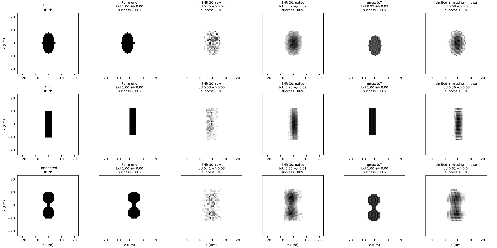

# q-Space Imaging Robustness Study

q-Space pore imaging infers a real-space pore shape from diffusion-encoded
signal intensity. The reconstruction is an inverse problem: phase is missing,
high-q measurements are weak, and experimental sampling is noisy or incomplete.
A visually plausible pore is therefore not enough; the method must be tested
against controlled losses of information.

Use this page to understand the robustness study rather than to learn the basic
PGSE sequence. It asks how much pore shape survives three common acquisition
limitations:

- finite intensity SNR;
- a reduced radial q-space window; and
- randomly missing samples inside that window.

The reported geometries are synthetic ground-truth tests. They establish
algorithm behavior for these shapes and sampling conditions, not universal
resolution or success guarantees for experimental porous media.

The reproducible driver is
[`examples/plot_pgse_qspace_robustness.py`](https://github.com/supertjhok/MRSpinDynamics/blob/main/PythonSpinDynamics/examples/plot_pgse_qspace_robustness.py).
It evaluates an ellipse, a narrow slit, and a connected dumbbell domain over
five independent phase-retrieval seeds. Quality is measured after optimizing
over the unavoidable translation and reflection ambiguities. A trial is counted
as successful when the thresholded pore-mask intersection-over-union (IoU) is
at least 0.5.

## Reference study

The committed reference uses a 48 × 48 grid, 240 HIO iterations plus 60
error-reduction iterations, intensity SNR 30, `qmax_fraction=0.7`, 25% random
dropout inside the retained window, and a two-sigma intensity gate. Run it with:

```powershell
python examples\plot_pgse_qspace_robustness.py `
    --output results\qspace_imaging_robustness.png `
    --csv results\qspace_imaging_robustness_trials.csv
```



The full trial-level data are in
[`docs/assets/qspace_imaging_robustness_trials.csv`](assets/qspace_imaging_robustness_trials.csv).

| Geometry | Condition | q-space coverage | Mean correlation | Mean IoU | IoU ≥ 0.5 |
|---|---:|---:|---:|---:|---:|
| Ellipse | Fully sampled | 100.0% | 1.000 | 1.000 | 100% |
| Ellipse | SNR 30, raw | 100.0% | 0.663 | 0.454 | 20% |
| Ellipse | SNR 30, gated | 100.0% | 0.897 | 0.668 | 100% |
| Ellipse | q range 0.7 | 38.4% | 0.977 | 0.986 | 100% |
| Ellipse | Combined, gated | 28.8% | 0.882 | 0.685 | 100% |
| Slit | Fully sampled | 100.0% | 1.000 | 1.000 | 100% |
| Slit | SNR 30, raw | 100.0% | 0.708 | 0.534 | 80% |
| Slit | SNR 30, gated | 100.0% | 0.898 | 0.699 | 100% |
| Slit | q range 0.7 | 38.4% | 0.999 | 1.000 | 100% |
| Slit | Combined, gated | 28.8% | 0.889 | 0.756 | 100% |
| Connected | Fully sampled | 100.0% | 1.000 | 1.000 | 100% |
| Connected | SNR 30, raw | 100.0% | 0.633 | 0.409 | 0% |
| Connected | SNR 30, gated | 100.0% | 0.886 | 0.659 | 100% |
| Connected | q range 0.7 | 38.4% | 0.991 | 1.000 | 100% |
| Connected | Combined, gated | 28.8% | 0.831 | 0.623 | 100% |

## Interpretation

The q-window is not the first limiting factor for these compact shapes. Keeping
the central 38.4% of the rectangular q grid preserves mean IoU above 0.98 for
all three geometries, although it smooths the recovered edges. Intensity noise
is more damaging because clipping noisy intensities at zero creates a positive
high-q floor. At SNR 30, raw retrieval fails most ellipse trials and every
connected-domain trial.

Applying a known two-sigma intensity gate before phase retrieval restores 100%
success for all three geometries. Even the combined case—SNR 30, q range 0.7,
and 25% random dropout, leaving only 28.8% of the original grid—retains mean IoU
from 0.62 to 0.76.

The practical acquisition rule is therefore to estimate the intensity-noise
floor, preserve the zero-q normalization, and pass an explicit sampling mask to
phase retrieval. Unmeasured points must remain unconstrained; inserting zeros
as if they were acquired data produces avoidable truncation artifacts.

## Limits

These results use ideal long-time pore intensities so that acquisition coverage
and reconstruction robustness can be isolated. The separate finite-pulse walker
test validates the forward-to-inverse connection for an elliptical pore. The
reported thresholds are regression anchors for these grids and supports, not a
universal experimental guarantee; different pore contrast, support error, SNR
models, or much narrower q windows should be re-swept with the same driver.
