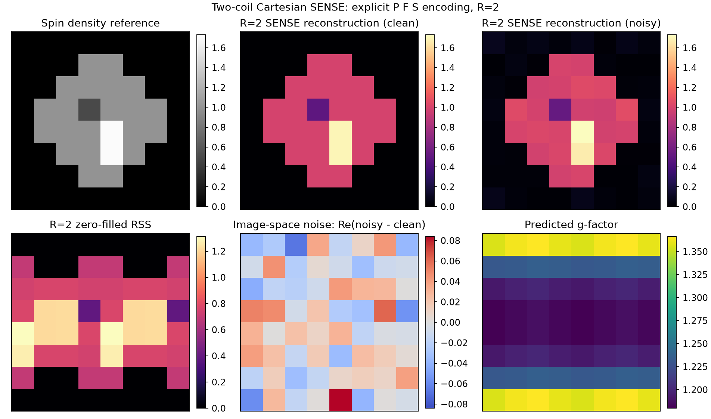

# Cartesian SENSE imaging

Phase 3 adds explicit Cartesian sensitivity encoding for receiver arrays. It
uses the complex reciprocal \(B_1^-\) maps preserved by Phases 1 and 2 and keeps
sensitivity estimation separate from reconstruction.

## Forward model

The reusable encoding operator evaluates

\[
  y_c = P F\{s_c(r)m(r)\} + n_c,
\]

where \(m\) is a complex image, \(s_c\) is the supplied channel sensitivity,
\(F\) is the centered spatial Fourier transform, and \(P\) retains uniformly
spaced Cartesian lines. Arrays remain channel-leading:

```text
sensitivity       : (n_rx, nx, nz)
image             : (nx, nz, n_echo)
sampled k-space   : (n_rx, nx, nz, n_echo)
sampling mask     : (nx, nz)
```

The low-level operator is useful with simulated, measured, or externally
estimated maps:

```python
from spin_dynamics.workflows import (
    CartesianSENSEEncoding,
    reconstruct_cartesian_sense,
    uniform_cartesian_mask,
)

mask = uniform_cartesian_mask((64, 64), 2, axis="x")
encoding = CartesianSENSEEncoding(sensitivities, mask, noise_covariance=psi)
sampled = encoding.forward(reference_image)
result = reconstruct_cartesian_sense(
    sampled,
    sensitivities,
    mask,
    axis="x",
    noise_covariance=psi,
    regularization=1e-6,
)
```

`CartesianSENSEEncoding.adjoint` is the exact Euclidean adjoint of the
unnormalized centered `P F S` transform. This makes the operator reusable by
future iterative or compressed-sensing solvers without changing conventions.

## Uniform masks and axes

`uniform_cartesian_mask` samples complete lines with an integer acceleration.
The encoded dimension must be divisible by the acceleration so every folded
alias set has the same size. `offset=0` retains the centered k-space line;
other offsets select a different congruence class.

The image code historically calls its two spatial axes `x` and `z`, regardless
of the physical `ImagingPlane`. Therefore:

- `axis=0` or `axis="x"` accelerates the first array dimension;
- `axis=1` or `axis="z"` accelerates the second array dimension.

## Whitening and alias-set solve

For channel covariance \(\Psi=E[nn^H]\), SENSE solves each folded alias set
with

\[
  (E^H\Psi^{-1}E + \lambda I)\hat m
  = E^H\Psi^{-1}d.
\]

`noise_whitener` returns the Hermitian inverse square root of \(\Psi\), and
`whiten_receiver_channels` applies it to arbitrary channel-leading data.
Positive-semidefinite covariance is supported through pseudoinverses. The
regularization parameter \(\lambda\) is an absolute Tikhonov penalty; zero is
the unregularized SENSE solve.

`CartesianSENSEResult` contains:

- `image`: unfolded complex image stack;
- `sampled_kspace`: the masked channel data used by the solve;
- `zero_filled_channel_image`: aliased channel images before unfolding;
- `condition_number`: whitened local encoding condition number;
- `rank`: local encoding rank;
- `g_factor`: predicted unregularized geometry factor.

Rank-deficient alias sets receive infinite condition number and g-factor.
Pass `raise_on_rank_deficiency=True` to reject them instead of returning a
regularized or minimum-norm image.

The reported g-factor follows the standard SENSE convention: accelerated
noise standard deviation relative to a fully sampled optimal combination,
after removing the unavoidable \(\sqrt{R}\) sampling penalty. It describes the
unregularized encoding even when a nonzero regularizer is used, because
regularization trades variance for bias.

## Experiment facade

An ideal `RxArray` CPMG experiment can request the same reconstruction:

```python
record = Experiment(
    sequence=CPMGImaging(num_echoes=2, ny=3),
    sample=Sample(phantom=phantom),
    hardware=Hardware(rx_coil=receivers, plane=plane),
    acquisition=Acquisition(
        receiver_noise_covariance=psi,
        receiver_noise_seed=7,
        sense_acceleration=2,
        sense_axis="x",
        sense_regularization=1e-6,
    ),
).run()

result = record.result
unfolded = result.sense_image
unfolded_noisy = result.sense_image_noisy
```

The CPMG simulator retains a fully sampled, unweighted reference response from
the same Bloch propagation. Phase 3 then applies the explicit `P F S` operator
to that reference. This is deliberate: the legacy gradient grid is a physical
phase-encode approximation rather than an exact discrete FFT grid. Separating
the reference solve from `P F S` preserves Phase 2 outputs and gives Phase 3 an
exact, testable forward model.

The receiver-array result exposes:

- `sense_reference_image`: unweighted complex ground truth;
- `sense_sampled_kspace`: clean acquired channel samples;
- `sense_zero_filled_channel_image`: clean aliased channels;
- `sense_image`: clean unfolded image;
- matching `*_noisy` products when receiver noise is enabled;
- the mask, acceleration, axis, offset, regularization, rank, conditioning,
  and g-factor maps.

Planning rejects SENSE without an `RxArray`, acceleration larger than the
channel count, and image dimensions not divisible by the acceleration.

## Runnable example

```bash
python examples/plot_receiver_array_sense.py \
  --pixels 8 --noise-std 0.20 \
  --output results/receiver_array_sense.png
```



The example solves two offset receive coils by reciprocity, then uses the direct
Cartesian `P F S` operator to generate an exact R=2 acquisition from the spin
density. This keeps the SENSE demonstration on its natural even matrix without
inheriting the legacy compact CPMG phase-encode grid. It plots the reference,
clean and noisy SENSE reconstructions on one intensity scale, the zero-filled
RSS image, an independently scaled `Re(noisy - clean)` residual, and g-factor.
A printed scale-independent shape error verifies that the clean reconstruction
recovers the reference.

This phase implements uniform single-axis Cartesian SENSE with supplied or
simulated sensitivity maps. It does not estimate maps from calibration data,
handle arbitrary-density masks, jointly regularize echoes, or provide a
compressed-sensing prior. The existing compressed-sensing tools remain
optional image priors rather than substitutes for coil encoding.

Electrical mutual coupling, loaded channel transfer functions, and
circuit-derived covariance are implemented by an optional Phase 4
`ReceiverNetwork`; see [Coupled receiver networks](receiver_networks.md).
SENSE automatically uses its loaded effective maps and covariance. The Phase 5
[birdcage model](birdcage_coils.md) now supplies matched-input reciprocal B1-
maps and passive covariance in the same channel-leading convention, so those
maps can be passed to this encoding layer without a separate reconstruction
convention.
